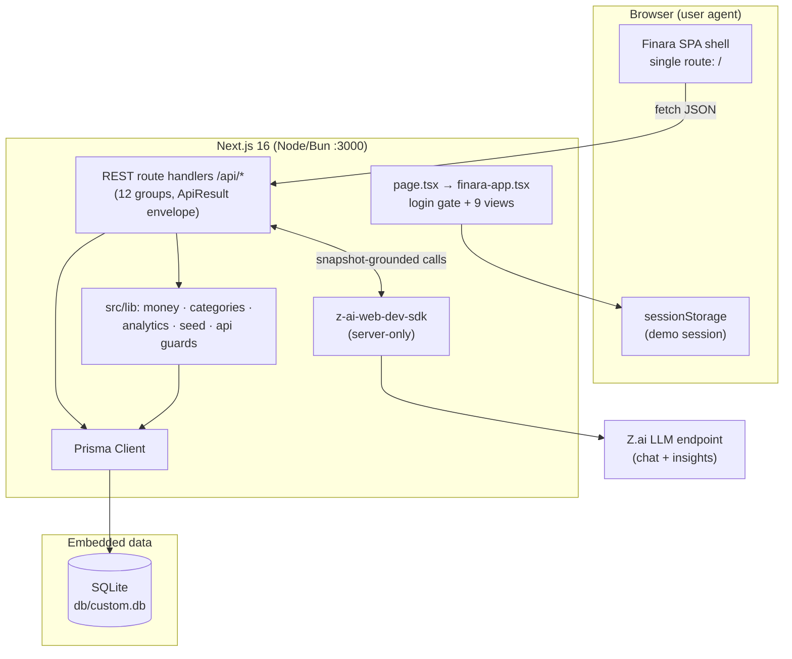

**Last Updated:** 2026-09-17 (v1.11 — quality-infrastructure round 12: the Playwright E2E layer (66 specs / 11 files in `e2e/`, running against the production build on :3100 with a hermetic `db/e2e.db` — locking every browser golden path from rounds 4–11: login round trips + titles, theme lifecycle, expense CRUD + filters + bulk bar, FAB Quick Add + the FAB-as-close-toggle contract, income/goal/account/investment CRUD incl. the complete-state ring, analytics tabs + ghost tooltip + inert From/To, CSV import + exports verified **settings-independent** under EUR + dd/MM/yyyy (live probe: ISO dates + raw decimals under both settings — byte-identical), GDPR round-trip, EUR/dd-MM/yyyy propagation, mobile drawer, and a zero-console-errors sweep over all 9 views), the GitHub Actions CI pipeline (`.github/workflows/ci.yml` — lint → typecheck → unit → build + E2E on every push/PR to main), three live-probed parity fixes surfaced by the E2E work (the login-surface title contract — bare `Finara` on /login AND on unauth deep-link redirects, with an unauth deep link settling on it via a render-time route adjustment that reads the LIVE session store; the `<title>`-hydration mechanism — the App Router rewrites the title node's textContent AFTER client effects, so the title sync is a MutationObserver-guarded post-commit effect; the import path now accepts negative amounts like every other layer — ADR-024 alignment for rows mode + finara-export restore; the Quick Add chooser is `modal={false}` with `onInteractOutside` suppressed — Radix's modal body-lock `pointer-events:none` deadened the z-50 FAB toggle), and `tailwind.config.ts` + the dead `tailwindcss-animate` dependency deleted (v4 CSS-first pipeline, `tw-animate-css` via CSS import); 275-test unit suite + 66-spec E2E suite. Prior: v1.10 — round 11: ADR-024 signed minor units (the live app performs ZERO amount validation — negative expenses/income/balances/goals/investments persist and render `-$5.50` style, so every `min="0"` was removed from the forms, `toMinorUnits` accepts negatives, and the API guards became `requireSignedInt`/`requireFiniteNumber`; negative goal contributions stay a silent no-op and progress is never capped — 150% over target renders 150.0%), the goal complete-state contract (emerald card ring + Complete badge with the circle-check-big icon + the Add Progress button removed entirely at progress ≥ 100%), the chart tooltip = the live's borderless ghost overlay (its raw-HSL-triple tokens make the inline `var()` color refs invalid-as-color — background transparent, border shorthand fully invalidated, inherited text; replicated as `{ backgroundColor: "transparent", border: "none", borderRadius: 8 }` and verified by computed-style byte-match + tooltip-crop pixel analysis in both themes), legend census 1/0/0/0, the null default expense-filter min (negatives visible), investment-form attrs aligned (steps 0.01/0.1, optional current price → 0), Select-popup class pins, and `formatMoney(-0)` → `-$0.00`; 270-test suite. Prior: v1.9 — round 10: ADR-019 primary-family amendment (`--primary`/`--primary-foreground` re-pinned to the live neutral ink/paper pair via a variable-level probe — light `#171717`/`#fafafa`, dark `#fafafa`/`#171717`; dark `--ring #d4d4d4`; dark `--destructive #7f1d1d`; `--destructive-foreground #fafafa` both themes — progress fills, switches, checkboxes, and default buttons render monochrome; sage CTAs keep `--primary-sage`), ADR-023 theme lifecycle (sign-out resets to light + clears the stored key; sign-in re-applies the server-side theme from `/api/settings` async like the live User/me hydration; every toggle persists fire-and-forget — the theme follows the account across sign-out/sign-in cycles), mobile menu button swaps Menu↔X while the drawer is open, first full light+dark VLM screenshot sweep since round 5 (16/18 pairs visually equivalent pre-fix; the 3 flagged pairs re-shot post-fix: all equivalent; EUR quick-amount chips, Save-Settings flow, and the live-shared overflow quirks verified), 251-test suite
**Audience:** Senior Engineers, Tech Leads, DevOps, and Onboarding Engineers
**Rule:** Every architectural decision in this document traces to a specific rationale. Nothing is here "because it's popular."

---

## Table of Contents

1. [System Overview & Decisions](#1-system-overview--decisions)
2. [High-Level System Topology](#2-high-level-system-topology)
3. [Application Architecture](#3-application-architecture)
4. [Data Architecture](#4-data-architecture)
5. [Design System Reference](#5-design-system-reference)
6. [Security Architecture](#6-security-architecture)
7. [Testing Strategy](#7-testing-strategy)
8. [Build & Deployment](#8-build--deployment)
9. [Developer Handbook](#9-developer-handbook)
10. [Known Issues & Outstanding Tasks](#10-known-issues--outstanding-tasks)
11. [Key Files Reference](#11-key-files-reference)
12. [Glossary](#12-glossary)

---

## 1. System Overview & Decisions

### 1.1 Document Metadata & Purpose

Finara is a personal-finance dashboard: income, expenses, 50/30/20 budgets, accounts, investments, savings goals, CSV import, analytics, and AI-grounded insights. This PAD is the single source of truth for how the system is built and why. Use it when onboarding, extending a view/API pair, debugging the data flow, or replicating the architecture. It documents the current state only — no roadmap.

### 1.2 Technology Stack Summary

| Layer | Technology | Version | Key Rationale |
|-------|-----------|---------|---------------|
| Web framework | Next.js (App Router, Turbopack) | 16.1.3 | Route handlers + RSC-capable shell; the reference app it clones is a React SPA, and Next's single-page mode fits both the clone and the deployment sandbox |
| UI runtime | React | 19 | Required by Next 16; React Compiler enabled for automatic memoization discipline |
| Language | TypeScript (strict) | 5 | The app's core risk is money arithmetic and boundary data — strict typing is the cheapest defense |
| Styling | Tailwind CSS | 4 (CSS-first `@theme`) | Token-driven palette with zero runtime; v4's inline theme keeps shadcn tokens in one CSS file |
| Component primitives | shadcn/ui (new-york) on Radix | current | Accessible dialogs/selects/switches/tabs for free; matches the original app's look |
| Charts | Recharts | 2.15.4 | Declarative SVG charts matching the original dashboard's trend/area/pie visuals |
| ORM | Prisma | 6.19 | Typed SQLite access; schema-as-code with a one-command push loop for an embedded DB |
| Database | SQLite | 3 | Single-user personal finance app — an embedded file database removes all ops surface |
| AI | z-ai-web-dev-sdk | 0.0.18 | Server-side LLM access for the coach chat and insight phrasing; never shipped client-side |
| Validation | Custom guards (`src/lib/api.ts`) | — | Small, typed, dependency-free; mirrors the ActionResult envelope convention |
| Lint | ESLint 9 flat config + eslint-config-next | 9 | Includes React Compiler rules as hard errors (see §3.3) |
| Package manager / runtime | Bun | ≥ 1.3 | Fast installs; committed `bun.lock` guarantees reproducible resolution |

### 1.3 Architecture Decision Records (ADRs)

**ADR-001: Single-route SPA instead of file-based routing** *(navigation model superseded by ADR-021 — the single-mount SPA shell remains)*

- **Context:** The original Finara app is a base44 SPA with client-side navigation. The clone must reproduce its UX (sidebar switching nine screens, dialogs, no full page loads) while running on Next.js.
- **Decision:** One page route (`src/app/page.tsx`) renders a client shell that switches `ViewId` state; all server interaction goes through `/api/*` route handlers.
- **Rationale:** Faithful clone semantics (instant view switches, preserved dialog state), plus the preview environment only exposes `/`. Nine page routes would add routing complexity the original doesn't have.
- **Consequences:** (+) Zero navigation latency; one layout to theme. (−) No per-view URL deep links; back button doesn't switch views. *(Round-8 probes showed the live app DOES serve real paths with deep links and back/forward — ADR-021 restored those via a catch-all route + pushState/popstate while keeping this ADR's single-mount shell.)*
- **Alternatives Rejected:** Next file-based routes per view (breaks SPA fidelity + sandbox constraint); react-router inside Next (duplicates what view state does with more machinery).

**ADR-002: Money as integer minor units everywhere**

- **Context:** Float arithmetic on currency produces classic rounding drift; the reference codebase (Scandi Haven) proved the integer-minor-units discipline in production.
- **Decision:** Every persisted money column is `Int` `*Minor` (cents). Conversion to/from decimal happens only at the UI/API edge via `toMinorUnits`/`formatMoney` in `src/lib/money.ts`.
- **Rationale:** Eliminates an entire class of financial bugs by construction; `Intl.NumberFormat` renders for humans.
- **Consequences:** (+) Exact sums, no drift, trivial DB aggregation. (−) Every new money field must remember the convention (enforced by review + AGENTS.md).
- **Alternatives Rejected:** Floats (rounding); decimal strings (parse complexity); DB DECIMAL (SQLite lacks native decimal).

**ADR-003: Prisma + SQLite over Postgres**

- **Context:** Single-user personal finance data with modest write volume; the repo must clone-and-run with zero external services.
- **Decision:** SQLite file at `db/custom.db` accessed through Prisma Client.
- **Rationale:** No server to provision, back up, or authenticate; `db:push` is the whole migration story for a demo-grade app; Prisma keeps the code typed and portable.
- **Consequences:** (+) One-command setup; file-level backup. (−) No concurrent multi-process writes (fine for this workload); upscaling to Postgres later requires schema provider swap + migrations (documented in §10).
- **Alternatives Rejected:** Postgres + Docker (ops overhead for a personal app); in-memory/localStorage (no server-side aggregation, no AI grounding).

**ADR-004: Demo login gate, not production auth**

- **Context:** The original app has real (Google + email) auth; this clone is a single-tenant demo whose credentials are published in the README.
- **Decision:** The login screen validates the documented demo credentials client-side; session presence is held in `sessionStorage` via a `useSyncExternalStore` external store.
- **Rationale:** Reproduces the original's sign-in UX without fabricating security. Real auth would add a password store, session backend, and multi-tenancy the clone doesn't need — and falsely implying it exists would be worse than honestly not having it.
- **Consequences:** (+) Faithful UX, zero auth complexity. (−) NOT production-safe; every doc states this explicitly; replacing it is the top backlog item (§10).
- **Alternatives Rejected:** NextAuth/Better-Auth with a demo user (half-fake security, more moving parts); no login screen at all (breaks clone fidelity).

**ADR-005: Database-level seed lock with completion marker**

- **Context:** Twelve route groups all call `ensureSeeded()` on first request; concurrent first requests (dashboard + insights fire together) double-seeded the database in practice — a module-global promise alone did not survive Next dev's per-bundle module instances.
- **Decision:** `seed()` inserts a unique `Setting._seed_lock` row first (DB-level mutex); losers poll for the `_seeded` marker (bounded ~5 s) before reading; the winner publishes `_seeded` last.
- **Rationale:** SQLite's unique constraint is atomic across every process/bundle that can touch the file — the only mutex that covers all observed failure modes. Verified with a 5-way concurrent request burst (zero duplication).
- **Consequences:** (+) Exactly-once seeding under any concurrency the app can generate. (−) Two sentinel rows live in `Setting` (filtered out of settings/export reads); a crashed seed leaves the lock held (fresh-DB retry is the remedy, documented).
- **Alternatives Rejected:** Module-global promise only (empirically insufficient in dev); `SELECT ... FOR UPDATE`-style advisory lock (not available on SQLite).

**ADR-006: AI grounding via server-side snapshot, with deterministic fallback**

- **Context:** LLM answers about personal finances must reflect the user's actual numbers; the model must also never be a single point of failure for the dashboard.
- **Decision:** Both AI endpoints first aggregate a compact snapshot from the DB (income, month-to-date categories, budgets, goals, portfolio). `/api/ai/chat` passes it as the system context; `/api/ai/insights` drafts deterministic insights, asks the model to polish them, and falls back to the drafts on any model error.
- **Rationale:** Prompt-injection-resistant grounding (the model sees numbers, not raw user text), and the dashboard never renders an empty error state when the model is down.
- **Consequences:** (+) Answers cite real figures; insights always render. (−) Snapshot assembly is server-only code that must stay in sync with new entities (AGENTS.md rule).
- **Alternatives Rejected:** Raw user question + full JSON dump to the model (injection risk, token cost); client-side SDK use (credential exposure).

**ADR-007: Income frequency normalization to monthly equivalents**

- **Context:** A biweekly $4,800 salary is $10,400/month, not $4,800 — naive sums misreport every derived KPI (savings rate, budget surplus, AI answers).
- **Decision:** `monthlyEquivalent(amountMinor, frequency)` in the pure `src/lib/money.ts`: biweekly ×26/12, weekly ×52/12, annual ÷12 (`quarterly`/`one-time` remain as legacy-data guards only). Every income total path (dashboard, analytics, insights, chat snapshot, income view) calls it.
- **Rationale:** One canonical, client-safe (no Prisma import) function keeps all five consumers consistent — it lives in `money.ts` precisely so client components can import it without dragging the DB client into the browser bundle.
- **Consequences:** (+) Correct KPIs everywhere. (−) "Monthly Income" excludes one-time windfalls by definition (an honest, documented choice).
- **Alternatives Rejected:** Raw sums (wrong); per-source next-payment projection (overkill for KPI cards).

**ADR-008: Dark mode as a module-level external store (`useSyncExternalStore`)**

- **Context:** The source app toggles a `dark` class on `document.documentElement` and persists the choice; React Compiler forbids the usual read-in-effect patterns, and SSR must not flash the wrong theme.
- **Decision:** `src/components/finara/theme.ts` exposes read/subscribe/write functions backed by `localStorage["finara-theme"]`. The shell consumes it via `useSyncExternalStore` with a `null` server snapshot; writes flip the `<html>` class and persist. `<html suppressHydrationWarning>` in `layout.tsx` absorbs the post-hydration class flip. Component dark styling uses Tailwind `dark:` variants; global tokens live in the `.dark` block of `globals.css`.
- **Rationale:** Identical discipline to the session gate (ADR-001's SPA shell): one external store, one subscription point, no effect-body setState (a compiler ERROR), no hydration flash.
- **Consequences:** (+) Theme survives reload; toggle works from the user menu (desktop) and the sun/moon button (mobile). (−) Every new view must remember its `dark:` variants (reviewed in the parity checklist).
- **Alternatives Rejected:** `next-themes` (adds a dependency for a 40-line store); CSS-only `prefers-color-scheme` (no user control); class toggle in an effect (compiler error).

**ADR-009: Pure domain layer with Vitest seams (TDD)**

- **Context:** Round-1 verification caught math bugs (analytics averages dividing all-time totals by window months; trend placeholders vs. real month-over-month) that browser spot-checks missed — the logic needed executable specifications.
- **Decision:** Framework-free modules own every piece of domain math: `dashboard-kpis.ts` (KPI computation incl. placeholder-fallback trends and goal-progress savings), `expense-filters.ts` (filter/sort/badge-count logic), `date-format.ts` (5 format patterns), `import-export.ts` (Finara export normalization), `ui-maps.ts` (live-verified visual maps), plus the existing `money.ts`/`categories.ts`. Each carries a Vitest spec in `src/lib/__tests__/` (76 tests); views and route handlers stay thin consumers. Behavior changes land red → green.
- **Rationale:** Pure functions are the cheapest thing to test; hoisting them out of components also satisfies the client-import rule (no Prisma/React in `src/lib` domain modules).
- **Consequences:** (+) Regressions in money math and parity rules now fail CI-locally before review; the KPI semantics are documented in code. (−) A second place to look for logic (lib, not view) — the rule is "if it computes, it lives in lib".
- **Alternatives Rejected:** Component-level React Testing Library tests (slower, brittle); snapshot tests (verify shape, not math).

**ADR-010: Taxonomy alignment with the source app + legacy normalization map**

- **Context:** The round-2 live-site audit captured the source app's exact native-select enums; the clone's drift (extra `one-time`/`quarterly` frequencies, missing income categories/goal priorities/investment types, SGD vs. the 10-currency set) surfaced in six dialogs.
- **Decision:** `src/lib/categories.ts` is the single source of truth and now mirrors the source sets exactly (subcategories + emoji order, frequencies `monthly|weekly|biweekly|annual`, income categories, goal categories + priorities, investment types + 9 sectors, account types, 10 currencies, 5 date formats). Pre-remediation rows normalize through a legacy subcategory map on API write; the seed emits only the new taxonomy. `categories.test.ts` pins every set.
- **Rationale:** One module feeds API validation, UI selects, and the CSV import guesser — aligning it once fixes every dialog; the test keeps future drift impossible to merge silently.
- **Consequences:** (+) Six dialogs match the source app; validation and UI can't diverge. (−) The legacy map is dead code once no pre-remediation databases exist (safe to remove later).
- **Alternatives Rejected:** Per-dialog hardcoding (the original bug); a DB enum table (overkill for a pinned set).

**ADR-011: Source-exact design system via CSS variables + captured utility classes (round 3)**

- **Context:** Rounds 1–2 approximated the source look (flat slate canvas, `shadow-sm` cards, emerald-500 buttons). The round-3 audit captured the live app's full DOM and stylesheet: gradient page shell, `bg-white/80 backdrop-blur-sm shadow-lg` cards, `--primary-sage #059669` / `--primary-navy #1E293B` tokens, vertical sidebar gradient, gray-based dark overrides, exact 500→600 feature-card gradients.
- **Decision:** `globals.css` now defines the Finara token set (`:root`/`.dark`), `.sidebar-gradient`, `.card-hover`, and the `.text-primary-navy`/`.bg-primary-sage` utility families; every view was restyled with the exact utility-class strings extracted from the live DOM. Per-name visual maps that cannot be utility classes (9 sector hexes, 7 goal emoji, priority badges, account icons, 50/30/20 dots/badges) live in the pure module `src/lib/ui-maps.ts`, pinned by `ui-maps.test.ts`.
- **Rationale:** Pixel parity by construction: copying verified strings beats re-deriving approximations; centralizing the non-class maps prevents per-view forking (the sector colors are fixed per sector NAME — proven by live delete-rank experiments — so a chart palette order would be wrong).
- **Consequences:** (+) 85–95 VLM parity scores across views; theme-exact dark mode. (−) Class strings are intentionally verbose literals (readability cost accepted for fidelity); the evidence archive lives outside the repo (referenced from the plan doc).
- **Alternatives Rejected:** Approximate restyle (round-1 result: visibly off); a component-level theme prop system (indirection without fidelity gain).

**ADR-012: Centered dialog system + native confirm() deletes (round 3)**

- **Context:** The clone used right-side Sheets for Add Transaction and immediate deletes; the live app opens every dialog as a centered modal (`max-w-2xl`, black/50 overlay) and deletes via the browser's native `confirm()` with fixed texts.
- **Decision:** All add/edit dialogs (transaction, income, goal, account, investment, AI Coach at `h-[80vh]`) are shadcn `Dialog` centered modals; the Add Expense modal opens in Quick Select mode (5 Needs subcategories) then swaps to the manual form in place with "← Back to Quick Select". Delete handlers wrap `window.confirm("Are you sure you want to delete this …?")` with the live app's exact wording; bulk delete pluralizes.
- **Rationale:** Structure parity is behavioral, not just visual — modal-vs-sheet changes focus flow, overlay affordance, and automation semantics; native confirms reproduce the live app's interruptive delete UX exactly.
- **Consequences:** (+) Verified E2E: FAB → Quick Select → manual → toast; confirm dialogs block correctly with exact texts. (−) Native `confirm()` is unstyleable (accepted — it is the source behavior); headless automation must stub/accept dialogs (documented in the verification workflow).
- **Alternatives Rejected:** Keeping Sheets (visible structural mismatch); styled AlertDialog replaces confirm (nicer, but breaks fidelity).

**ADR-013: CSS-only staggered entrance animations (round 3)**

- **Context:** The live app animates every section entrance with framer-motion (staggered fade/slide). Adding framer-motion for parity would cost a dependency + bundle weight for a decorative effect.
- **Decision:** `.fade-in-up` keyframe class + `.stagger-1..5` delay utilities in `globals.css`, applied to section wrappers; wrapped in `@media (prefers-reduced-motion: reduce)` to disable animation entirely.
- **Rationale:** Visually equivalent entrance for a fraction of the cost; reduced-motion accessibility is built in (closing the round-2 backlog item).
- **Consequences:** (+) Zero JS animation cost; reduced-motion safe. (−) Not spring-physics-identical to framer-motion (acceptable — entrance feel is matched, not physics). The live DOM therefore shows framer wrapper divs with settled inline styles where the clone shows `.fade-in-up`/`.stagger-*` wrappers — a documented, accepted signature delta in the round-4 diff.
- **Alternatives Rejected:** framer-motion dependency (bundle + complexity); no animation (visible parity gap).

**ADR-014: Quick Add FAB flow with rotating toggle (round 4, live-verified 2026-09-15)**

- **Context:** Round-4 live probes showed the FAB no longer opens the full Add Transaction modal: it opens a lightweight two-step **Quick Add** chooser, while the Expenses header button keeps the full Quick Select modal and the Dashboard header's "Add Transaction" navigates to the Expenses view.
- **Decision:** New `quick-add-dialog.tsx` — step 1 chooser ("What would you like to add?": Add Income / Add Expense, outline `h-12` buttons with colored trending glyphs) at overlay `z-40`; step 2 compact form (description, amount, category Select; income defaults frequency to monthly server-side). Expense submits `POST /api/expenses` with `subcategory: "other"`; income submits `POST /api/income`. The sage FAB (`z-50`) stays above the `z-40` overlay and acts as the close toggle, rotating its plus glyph 45° into an X while open (`<div style="transform: rotate(45deg)">` wrapper — live-exact).
- **Rationale:** Behavioral parity: the FAB flow, its z-layering, and the rotating affordance were all probed on the live app; the full modal remains reachable from the Expenses header (unchanged live behavior).
- **Consequences:** (+) FAB round-trip verified E2E (add → list → delete → clean); the full dialog stays for edits and Quick Select. (−) Two dialog systems coexist (deliberate — the live app has both); quick-added rows carry subcategory "other" and the default emoji, exactly like live.
- **Alternatives Rejected:** Reusing the full AddTransactionDialog for the FAB (breaks the probed live flow); routing the FAB to /Expenses (that is the Dashboard header button's behavior, not the FAB's).

**ADR-015: shadcn primitives pinned to the live app's classic class sets (round 4)**

- **Context:** The vendored `src/components/ui/*` had drifted to the newest shadcn snapshot (`data-slot` attributes, `transition-all`, `focus-visible:ring-[3px]`, `shadow-xs`, Card `gap-6 py-6` grids, Table `whitespace-nowrap`, Toaster as `ol`, …) while the live app renders the classic sets — this was root cause R1 of the round-4 diff, touching every view.
- **Decision:** All app-rendered primitives (`button, badge, card, input, label, select, tabs, checkbox, switch, table, scroll-area, progress, alert, toast/toaster, dropdown-menu, separator`) were reverted to the live-exact classic class strings and pinned by `src/lib/__tests__/ui-primitives.test.tsx` (16 specs: exact base strings for every variant/size, `Badge`/Toaster render as `div`, no `data-slot` anywhere). Radix behavior, `cn()` merging, and React 19 function components are preserved; `vitest.config.ts` now includes `.tsx` specs. Icons renamed upstream render as live-exact inline SVG where the shape changed (e.g. the classic angular `filter` polygon in `ClassicFilterIcon` — modern lucide aliases `Filter` to the rounded `Funnel`). In round 5, `DialogTitle` became a pure Radix semantics wrapper (no injected base — call sites own the live-exact strings, since every live modal title carries a different set).
- **Rationale:** The primitives are the multiply-leveraged layer of the UI: pinning their strings once fixes every view's signatures and prevents silent re-drift; the spec suite turns "do not upgrade shadcn primitives" into an executable rule.
- **Consequences:** (+) Per-view structural diff dropped to only documented deltas (see the round-4 plan §E.2); primitive regressions now fail CI. (−) `npx shadcn add`/`diff` would fight the pins (documented in AGENTS.md invariants); unused vendored primitives outside the pinned set (popover, tooltip, …) still carry newer internals — they are not app-rendered.
- **Alternatives Rejected:** Keeping the newest snapshot and overriding per call site (whack-a-mole across nine views); forking shadcn into a private registry (overkill for a pinned clone).

**ADR-016: The effective typeface is the live app's computed system stack, not Inter (round 5)**

- **Context:** Round-5 computed-style probes showed the live app renders everything in the Tailwind default system stack (`ui-sans-serif, system-ui, sans-serif, …`) — its root `font-sans` overrides the Inter `@import` on `<body>`. The clone mapped `--font-sans: var(--font-inter)`, rendering Inter everywhere.
- **Decision:** Set `--font-sans` to the Tailwind default stack in `globals.css`; keep `next/font` Inter loaded on `<body>` exactly like live's loaded-but-overridden import. Computed-style ground truth beats declared intent: what the user's screen shows is the parity target, not what either stylesheet declares.
- **Consequences:** Typography parity verified by probing computed `font-family` on h1/button/chart ticks; any future font change must re-probe the live app first.
- **Alternatives rejected:** keeping Inter (visibly different letterforms vs system-ui on every surface); dropping the Inter load entirely (would diverge from live's network/DOM shape).

**ADR-017: Charts render the live configuration (round 5)**

- **Context:** The audit found the clone's Recharts config hid axis/tick lines, disabled vertical grid, forced 12px ticks, used uppercase hex, and didn't restyle the grid in dark mode; live shows both grid directions, visible `#64748b` axis/tick lines, SVG-default 16px ticks, `dark:stroke-gray-600` on every grid line (dark grid computes `rgb(75,85,99)`), `dark:stroke-gray-400` on the axis `<g>`, and the default legend icon.
- **Decision:** Copy the live props verbatim: `CartesianGrid strokeDasharray="3 3" stroke="#e2e8f0" className="dark:stroke-gray-600"`, axes `stroke="#64748b" className="dark:stroke-gray-400" tick={{ fill: "#64748b" }}`, no fontSize, default legend icon, lowercase hex strokes. `className` propagates onto each grid `<line>` through recharts' `filterProps` (verified against recharts 2.15.4 source + dark-mode computed probe).
- **Consequences:** Chart acceptance = DOM presence of vertical/horizontal grid groups, axis-line/tick-line elements, and computed dark stroke `rgb(75,85,99)`.
- **Alternatives rejected:** keeping the "cleaner" hidden-axis look (visual divergence); inlining SVG to match live's path data exactly (maintenance cost, no visual gain).

**ADR-018: Tailwind palette pinned to the v3 hex values the live app renders (round 5)**

- **Context:** Tailwind v4 regenerated the default palette; several steps drift visibly from the v3 values the live app renders (blue-600 `#155dfc` vs `#2563eb` Δ17; red-500 Δ24; emerald-400 Δ52; purple-600 Δ35; gray/slate ramps ~1-4/255). Live dark probes confirmed v3 values end-to-end: grid `rgb(75,85,99)`, border-gray-600 `rgb(75,85,99)`, bg-gray-700 `rgb(55,65,81)`, bg-gray-800/80 `rgba(31,41,55,.8)`, text-gray-400 `rgb(156,163,175)`.
- **Decision:** `globals.css` defines `--color-<family>-<step>` for every token the UI uses (102 across 14 families) in an unlayered `:root` block — unlayered author CSS beats Tailwind's `@layer theme` and its `@supports (color:lab())` re-definitions without `!important`. The existing unlayered `.dark` text/border overrides keep winning over layered utilities, replicating live's slate-mapped dark text ramp.
- **Consequences:** Utilities render pixel-identical v3 colors in both themes; the pin is a parity contract (do not "modernize"). Regenerating the pin requires the used-token inventory (`rg` over `src/`) + the v3 reference values.
- **Alternatives rejected:** downgrading to Tailwind v3 (framework regression for a color-only concern); accepting the drift (fails computed-color parity on large surfaces like KPI gradients).

**ADR-019: The shadcn semantic tokens and the radius/blur utility scales are pinned to the live app's computed values (round 6)**

- **Context:** Round-6 computed-style probes (synthetic test divs + real elements, light and dark) showed the live app renders the CLASSIC shadcn *neutral* theme — light `--background #ffffff` (outline buttons were rendering light-gray in the clone), `--foreground #0a0a0a`, `--muted-foreground #737373` (clone ≈ #52525b), `--border`/`--input #e5e5e5`, `--secondary`/`--accent`/`--muted #f5f5f5`, `--ring #0a0a0a` (clone: emerald); dark `#0a0a0a` / `#fafafa` / `#a3a3a3` / `#262626`. The same probes showed Tailwind v4's regenerated utility scales drift: `rounded-md` 8px vs live 6px, `rounded-lg` 10px vs 8px, `rounded-xl` 14px vs 12px, `rounded-sm` 4px vs 2px, and `backdrop-blur-sm` 8px vs 4px (v4 shifted the blur scale; every glass card blurred double).
- **Decision:** `globals.css` `:root`/`.dark` semantic tokens resolve to the probed hex values, and `@theme inline` pins `--radius-sm: 0.125rem`, `--radius-md: 0.375rem`, `--radius-lg: 0.5rem`, `--radius-xl: 0.75rem`, `--blur-sm: 4px`. `src/lib/__tests__/design-tokens.test.ts` pins every value (parses the CSS). The same round pinned the dialog system to the live per-dialog matrix (header rows with in-flow close buttons, per-dialog widths/scroll/dark-cards, no DialogDescriptions anywhere) and probed the live overlay behavior: clicking the overlay does NOT dismiss the full modals (only the Quick Add chooser dismisses — it wires its own onPointerDown), so the backdrop color lives ON the overlay element and the round-4 backdrop-Close button was removed.
- **Consequences:** Computed-style parity on every surface (buttons white, muted text neutral-500, focus rings near-black, radii/blur at v3 values) — verified by re-probes; the pins are parity contracts. The radius pin intentionally changes the shadcn primitives' rounded utilities to v3 values (what live renders through the same utilities).
- **Alternatives rejected:** keeping the v4 defaults (fails computed parity on essentially every button/card); pinning only some tokens (probe evidence covers the full set used).
- **⚠️ Round-10 amendment (2026-09-17):** the round-6 primary-family values were a misattribution — the probe measured the sage budget-fill ELEMENT and pinned it to the `--primary` VARIABLE. A round-10 variable-level probe (`getComputedStyle(document.documentElement).getPropertyValue('--primary')`, both themes) showed the live `--primary`/`--primary-foreground` are the classic shadcn NEUTRAL ink/paper pair — light `#171717`/`#fafafa`, dark `#fafafa`/`#171717` — so progress fills, checked switches/checkboxes, and default-variant buttons render monochrome (the sage CTAs style via the separate `--primary-sage`, which is unchanged). The same dump re-pinned dark `--ring` to `#d4d4d4` (was `#0a0a0a` — nearly invisible on dark surfaces), dark `--destructive` to `#7f1d1d` (was `#ef4444`), and added the missing `--destructive-foreground #fafafa` in both themes. `design-tokens.test.ts` re-pins all of it. Lesson codified: probe the CSS VARIABLE itself, never a consumer element.

---

**ADR-020: Dialog form bodies and the lucide icon class order are pinned to the live app's DOM (round 7)**

- **Context:** Round 6 pinned dialog headers/cards but never opened the form bodies. Round-7 live captures of every dialog's interior (incl. edit-expense/goal/investment/account/income) showed: a systemic icon class-order delta (live renders `w-X h-X [margin]` on every app icon — only the shadcn Select internals and the import CloudUpload stay h-first); income quick-amount chips are compact (`h-8 rounded-md px-3 text-xs`, vs the expense `h-9 px-4 py-2`); the income-edit dialog still carried a pre-round-4 slate/emerald chip design and a bordered Active box live does not render; all live form grids are `gap-4`; live buttons rows are `flex gap-3 pt-4` with `flex-1` Cancel/submit (accounts: `justify-end gap-2 pt-4` with a DEFAULT primary submit — not sage); live submit labels are "Update X" (accounts edit: "Save Changes"); goal forms put Target Date full-width before a Category+Priority grid; investment fields pair (symbol+type, shares+avg cost, current+percent); live label ids are snake_case (`source_name`, `is_recurring`, `account_name`, …); the accounts card is `bg-card` in both themes; and every live form Label carries `leading-none` (the round-4 pin had missed it).
- **Decision:** `src/lib/__tests__/dialog-forms.test.ts` pins all of the above as source contracts (icon order, per-context div orders, user-menu anatomy, per-dialog form bodies); the finara components render the live strings. Icon order rule: lucide icons in `src/components/finara/*` render `w-X h-X` with margins after (the import CloudUpload is the live-evidenced h-first exception); sibling divs/spans follow their own per-context live evidence (in-flow close buttons `h-9 w-9`, AI-coach avatar `h-7 w-7`).
- **Consequences:** DOM-level parity inside every dialog; the spec bans h-first icon classes in finara views so regressions fail the suite. The accounts card renders `bg-card dark:bg-card` (one extra class vs live's single `bg-card` — computed-equal in both themes, documented approximation).
- **Alternatives rejected:** keeping the round-6 status quo for form bodies (visible deltas: wrong chip sizing, wrong Active row, wrong dark-mode accounts card); a blanket h→w flip including divs (live itself is mixed — per-context evidence required).

---

**ADR-021: The app serves the live real routes and renders live-exact class strings on every view surface (round 8)**

- **Context:** Round-8 probes showed the live app is an SPA over REAL paths (/Dashboard … /Settings) with `/` rendering the dashboard content but NO active nav pill, per-route document titles ("/" and "/Dashboard" -> "Finara"; others -> "X | Finara"; unknown -> "<Segment> | Finara" via camelCase split), a standalone 404 page for unknown paths, and a `/login?from_url=<url>` redirect for unauthenticated deep links that returns after sign-in. The clone was single-page (`href="/"` + view state). The same round's order-sensitive DOM diff found 172 rendered-class-order deltas across the nine views (shell, headers, card surfaces, grids, tiles, text margins, button tails), plus functional deltas: the clone paginated expenses (live renders every filtered row), its bulk bar was an emerald Move-to-Needs/Wants/Savings toolbar (live's is a blue bar whose Bulk Edit options are functionally inert — probed), and Quick Add step-2 lacked flex-1 buttons, the Check glyph, and the disabled-until-valid gate.
- **Decision:** `src/app/page.tsx` serves `/` (home marker) and `src/app/[...view]/page.tsx` maps every other path through `src/lib/routes.ts` (`parseRoute`, `VIEW_PATHS`, `segmentToTitle`) with `generateMetadata` titles; `FinaraApp` accepts the parsed route, navigates via `history.pushState` + `popstate` (single-mount SPA, anchors `preventDefault`), replaceState's unauthenticated deep links to `/login?from_url=...`, returns to from_url on sign-in, and renders the standalone `NotFoundView` for unknown paths. View surfaces render the live-exact class strings pinned by `src/lib/__tests__/view-surfaces.test.ts` (54 source contracts): the ui-bits card constants (CARD_DASHBOARD_SURFACE / CARD_HOVER / CARD_PLAIN — CARD_SURFACE retired), the Button default variant carries `shadow`, sage CTAs pass `bg-primary-sage hover:bg-primary-sage/90 text-white shadow-lg` without re-stating h-9, hand-written icon-title divs carry the full `font-semibold leading-none tracking-tight flex ...` literal, expenses renders all filtered rows with the live blue bulk bar and always-plural confirms, and Quick Add step-2 pins its live anatomy. `ClassicTrash2` (ui-bits) reproduces the live single-alias `lucide-trash2` class.
- **Consequences:** URL parity with the live app (deep links, back/forward, titles, 404), DOM order-parity on every view surface (final re-diff: 0 order deltas; residuals = documented buckets: clone animation prefixes, live framer-motion wrappers, data counts, Radix internals, a11y additions). Navigation stays client-side (no RSC round-trips). A signature-diff lesson is codified: signature diffs SORT classes, so every pin was re-extracted from the RAW capture — the round's initial "dashboard header variant", "Quick Actions order", "alphabetical empty state", and "CARD_RESTATE" pins were all sorting artifacts and were corrected before commit.
- **Alternatives rejected:** per-route folders (remounts views per navigation, loses the single-mount SPA feel, far more invasive); keeping the view-state SPA with cosmetic paths (no deep links/back-forward/titles — fails functional parity); a blanket class re-sort (live's own order is inconsistent per context — per-capture pinning required).

---

**ADR-022: Functional parity — settings propagate app-wide, exports are live-shaped, and probed-inert controls stay inert (round 9)**

- **Context:** Rounds 2–8 pinned static DOM/class parity; round 9 behaviorally probed the remaining surfaces on the live app. Findings: (1) saving a currency or date format on the live app reformats EVERY money figure and date on every view (EUR → € everywhere incl. the budget surplus pill; dd/MM/yyyy → every date incl. the full expenses list) and persists reloads — the clone's settings only reached the settings view. (2) The live Analytics Export downloads an all-TRANSACTIONS CSV (`"Date","Description","Category","Subcategory","Amount","Type"`, quoted, raw decimals, expenses date-only + income/investments microsecond timestamps, named `financial-report-<date>.csv`) — the clone exported a monthly-trend summary. (3) The live GDPR export is `{user, data:{expenses,income,savings_goals,investments,bank_accounts}, summary}` with snake_case fields, decimal amounts, `title` display names, Z-less microsecond timestamps, and the account email in the filename — the clone exported a flat camelCase shape. (4) The live From/To date pickers are INERT (unfinished wiring — any range leaves the charts unchanged, the same class as the round-8 Bulk Edit options) while the clone filtered its trend by them. (5) The live import error state is a full replacement card (`border-red-500`, CircleAlert `h-16 w-16` h-first, `text-xl font-bold` title, `text-neutral-500` message, default-primary "Start New Import") and the upload label renders through the Label primitive. (6) The live AI coach input row is a div, message rows are `flex gap-3 justify-start|end`, and its card carries a class order tailwind-merge cannot reproduce from the base. Two live integrations are currently quota-dead server-side (AI chat 402 silent-failure; CSV extract 402 error card) — the clone's working implementations stay as deliberate deltas.
- **Decision:** `useSettings()` (in `src/hooks/use-api.ts`) is the app-wide settings seam — every view threads `{ currency }` into `formatMoney` calls and `dateFormat` into `formatDate` calls; `budgetRemainingLabel` and `SurplusBadge` take a currency; both AI routes read it server-side (`readSettingsCurrency`); quick-amount chips follow it (expense `+ {code}{units}`, income `+{symbol}{units.toFixed(2)}` via the new `currencySymbol`). All client fetches carry `cache: "no-store"` (the API responses send no Cache-Control header and browsers heuristically cached them — stale values leaked after settings changes); the shell-level `AddTransactionDialog` renders mount-on-open so its settings slice is always fresh. `/api/export` serves the live GDPR shape (identity from `src/lib/demo-user.ts`) plus `?type=transactions` for the analytics CSV; `normalizeFinaraExport` accepts the live snake_case shape AND the legacy clone camelCase shape, and investments are restorable (`InvestmentInsert`). The From/To inputs render uncontrolled with no filtering. The import error card, upload Label, and AI coach orders follow the captured live strings (`functional-parity.test.ts` pins all of it). `formatMoneyCompact` is deleted — the live app renders full money strings on BOTH chart axes.
- **Consequences:** (+) Behavioral parity on every probed surface; the export/restore round-trips live files. (−) The EUR chip variants are reasoned from the USD templates (live evidence is USD-only — documented); the AI/CSV working implementations remain reversible deltas until the live quota resets.
- **Alternatives rejected:** hardcoding USD in views (fails propagation); keeping the trend-summary CSV export (wrong format + filename); "fixing" the inert From/To pickers (the live app never wired them — parity means reproducing the quirk); a global settings context (invasive — the per-mount `useSettings` + no-store fetch + mount-on-open dialog achieves the same observable behavior with less machinery).

---

**ADR-023: The theme follows the account — sign-out resets, sign-in re-applies the server theme, toggles persist (round 10)**

- **Context:** Round-10 live probes of the full auth cycle showed the source app's theme lifecycle: signing out (from dark) CLEARS the stored theme key entirely (not set to "light") and removes the `dark` class, so the login page always renders light (a manually-stored dark key is never applied on /login either — verified); signing in re-applies the theme from the SERVER-side user record (its `User.theme`, delivered via the post-login `User/me` hydration — the session renders immediately and the theme lands asynchronously); every in-app toggle PUTs the theme to the user record (`User/me` carries `currency`, `dateFormat`, AND `theme`), which is what restores dark across a sign-out/sign-in cycle in a fresh browser. The clone kept the theme in `localStorage` only: signing out from dark left the login page DARK (a state the live app never shows), and a fresh-browser sign-in always started light.
- **Decision:** The theme becomes a `Settings` row (`theme String @default("light")` on the key-value model; seeded; validated `∈ {light, dark}` by `/api/settings`). `theme.ts` gains `resetTheme()` (applies light in-memory, REMOVES the stored key, does NOT re-persist — the exact live sign-out semantics); `finara-app.tsx` `handleSignOut` (the single seam routing both the user-menu and mobile-drawer sign-outs) calls it; `handleSignIn` fetches `/api/settings` async and applies `theme` when it resolves (server theme wins on entry, mirroring the live post-login hydration); both `toggleTheme()` call sites in `sidebar.tsx` go through `toggleThemeAndPersist()` (local apply first, then a fire-and-forget `PUT /api/settings {theme}` that never blocks or reverts the local apply). The same round re-pinned the semantic primary family (see the ADR-019 amendment) and fixed the mobile menu button to swap its glyph Menu↔X while the drawer is open.
- **Consequences:** (+) The full sign-out → login (light) → sign-in (server theme) → toggle (persisted) cycle matches the live app on both sign-out paths; a fresh browser recovers the preferred theme. (−) The clone persists the theme on its own Settings row rather than the live app's User record — an internal storage difference that is user-invisible (the observable lifecycle is identical).
- **Alternatives rejected:** keeping localStorage-only persistence (wrong login-page state after sign-out and no cross-browser recovery); resetting to a persisted "light" on sign-out (the live key is ABSENT, not "light" — probed); blocking sign-in on the settings fetch (the live app renders the session immediately and applies the theme async).

---

**ADR-024: Money is SIGNED integer minor units — the live app's zero-amount-validation behavior is replicated deliberately (round 11)**

- **Context:** Round-11 controlled live experiments (create → observe → delete, all cleaned up + verified) proved the source app accepts negative amounts at EVERY layer: negative expenses (`-5.5` → row renders `--$5.50`, totals subtract), income (`-$100.00`), account balances (`-$250.00`), goals (`-$500.00` target), investments (−10 shares / −$5 cost / empty current price / −15.5% portfolio), all with no `min` attribute on any numeric form input (native validation passes; `checkValidity() === true`) and no server-side sign checks. Two further behaviors: negative goal contributions are a SILENT NO-OP (PUT 200, current unchanged), and progress is NEVER capped (150 on a 100 target renders `150.0%`, `Complete` state). The clone blocked negatives at three client layers (`min="0"` ×12, `toMinorUnits` RangeError, an investments positivity gate) and two API layers (`requireNonNegativeInt`/`requirePositiveNumber` + one inline guard).
- **Decision:** Money remains integer minor units, but is signed end-to-end. `toMinorUnits` drops the `parsed < 0` rejection (keeps the non-finite guard); `formatMoney` renders `-$0.00` for −0 (`Object.is`); the API guards are renamed `requireSignedInt` (any safe integer) and `requireFiniteNumber` (any finite number); the goals POST drops `currentAmountMinor > targetAmountMinor`; the goals PATCH drops the `Math.min` cap (KEEPS the `contribution > 0` no-op); all 12 `min="0"` removed; investments submit keeps only a finite-NaN defense with empty current price → 0 and portfolio % passing any finite value through. The expense row keeps the live's double-minus quirk (`--$5.50`).
- **Consequences:** (+) Every money form and endpoint behaves exactly like the source app, including its quirks; a11y/product hardening that adds sign validation would now be a DIVERGENCE. (−) The clone deliberately ships no guardrails the live app lacks — acceptable because parity is the project's stated goal and this is a demo application.
- **Alternatives rejected:** keeping the positivity guards (diverges from every probed live flow); a config flag for strict validation (extra surface, no live counterpart); validating signs only in the import path (the live import is equally unprobed-but-permissive; permissive-only direction).

---

## 2. High-Level System Topology



**Scaling characteristics and constraints:** single Node process; SQLite allows one concurrent writer (sufficient — writes are interactive user mutations, not bulk traffic). The AI path is the only external dependency; both AI features degrade deterministically when it is unavailable (ADR-006).

---

## 3. Application Architecture

### 3.1 The Layer Model

```
Layer 0: Browser shell      — finara-app.tsx: session gate, ViewId state, dialogs.
                                 Rule: no data fetching logic here; owns navigation + refresh signals.
Layer 1: Feature views      — *-view.tsx (9): each owns one useQuery slice + local UI state.
                                 Rule: render from DTOs; never duplicate persisted data into client state.
Layer 2: Shared UI          — ui-bits.tsx + shadcn primitives.
                                 Rule: no domain logic; props in, elements out.
Layer 3: API surface        — src/app/api/*: validation guards + envelope + aggregation calls.
                                 Rule: never throw across the boundary; internals logged server-side only.
Layer 4: Domain libraries   — src/lib (pure where possible): money, categories, types, analytics, seed.
                                 Rule: only analytics/seed/db import Prisma; client code imports the pure set only.
Layer 5: Persistence        — Prisma + SQLite schema (7 models, integer minor units).
                                 Rule: money columns are Int *Minor; no floats ever.
```

**The Golden Rule:** data flows strictly downward (view → API → domain → Prisma); types flow upward through the single `src/lib/types.ts` DTO contract. Nothing in Layers 0–2 may import Layer 4's DB-touching modules.

### 3.2 Annotated Directory Structure

```
financial-dashboard/
├── src/
│   ├── app/
│   │   ├── page.tsx                    ← SPA entry: renders FinaraApp
│   │   ├── layout.tsx                  ← Inter font (400–800), metadata, Toaster
│   │   ├── globals.css                 ← Tailwind v4 @theme tokens (Finara palette)
│   │   └── api/
│   │       ├── dashboard/route.ts      ← KPI/budget/recent-activity aggregation
│   │       ├── income/route.ts + [id]/ ← income sources CRUD
│   │       ├── expenses/route.ts + [id]/← expenses CRUD (category validation)
│   │       ├── accounts/route.ts + [id]/← connected accounts
│   │       ├── budgets/route.ts        ← GET list / PUT upsert the 3 category budgets
│   │       ├── goals/route.ts + [id]/  ← goals CRUD + contributions
│   │       ├── investments/route.ts + [id]/ ← holdings CRUD
│   │       ├── import/route.ts         ← batch CSV import (row-level validation)
│   │       ├── analytics/route.ts      ← trends, breakdowns, portfolio metrics
│   │       ├── settings/route.ts       ← key-value preferences GET/PUT
│   │       ├── export/route.ts         ← GDPR full JSON download (file response)
│   │       └── ai/{chat,insights}/route.ts ← snapshot-grounded LLM features
│   ├── components/
│   │   ├── finara/
│   │   │   ├── finara-app.tsx          ← shell: session store, view switching, dialogs
│   │   │   ├── sidebar.tsx             ← desktop nav + mobile top nav (ViewId export)
│   │   │   ├── login-view.tsx          ← demo credential gate (constants exported)
│   │   │   ├── dashboard-view.tsx      ← KPIs, gradient cards, budgets, activity, insights
│   │   │   ├── income-view.tsx / expenses-view.tsx / accounts-view.tsx
│   │   │   ├── investments-view.tsx / import-view.tsx / analytics-view.tsx
│   │   │   ├── goals-view.tsx / settings-view.tsx
│   │   │   ├── add-transaction-dialog.tsx ← quick-select grid + manual form + quick amounts + edit prefill
│   │   │   ├── expense-filters-panel.tsx ← collapsible Filters panel (presets, min/max, sort)
│   │   │   ├── ai-coach-dialog.tsx     ← chat with quick actions + suggested questions
│   │   │   ├── theme.ts                ← dark-mode external store (useSyncExternalStore)
│   │   │   └── ui-bits.tsx             ← StatCard, GradientCard, EmptyState, TrendPill, …
│   │   └── ui/                         ← shadcn primitives (button, dialog, select, …)
│   ├── hooks/
│   │   ├── use-api.ts                  ← useQuery (loading/error/refresh) + mutate envelope
│   │   └── use-toast.ts                ← shadcn toast hook
│   └── lib/
│       ├── money.ts                    ← minor-units conversion, formatting, monthlyEquivalent (pure)
│       ├── categories.ts               ← source-app-aligned taxonomy + legacy map (pure)
│       ├── types.ts                    ← DTOs crossing the boundary (pure)
│       ├── dashboard-kpis.ts           ← KPI computation: goal-progress savings, placeholder-aware trends (pure)
│       ├── expense-filters.ts          ← filter/sort/badge-count logic for the expenses list (pure)
│       ├── date-format.ts              ← the 5 settings-aware date formats (pure)
│       ├── import-export.ts            ← Finara export normalization + flexible date parsing (pure)
│       ├── ui-maps.ts                  ← live-verified visual maps: sector hexes, goal emoji, badges, icons (pure)
│       ├── api.ts                      ← ApiResult envelope + validation guards (server)
│       ├── analytics.ts                ← getDashboard/getAnalytics aggregations (server)
│       ├── seed.ts                     ← idempotent, lock-guarded demo data (server)
│       ├── db.ts                       ← Prisma client singleton (server)
│       └── __tests__/                  ← Vitest specs (76 tests) for every pure module
├── prisma/schema.prisma                ← 7 models, Int *Minor money columns
├── db/                                 ← SQLite runtime storage (gitignored, .gitkeep)
├── docs/                               ← SSH wrapper + push runbook + reference image + plans/
├── vitest.config.ts                    ← Vitest runner (node env, @ alias)
├── public/finara-logo.png              ← login logo asset (source app)
├── .env.example                        ← DATABASE_URL only
├── AGENTS.md / CLAUDE.md / README.md   ← agent + human documentation
└── (eslint.config.mjs, tsconfig.json, tailwind.config.ts [legacy], postcss.config.mjs, components.json)
```

### 3.3 Critical Code Patterns

**Pattern 1 — The API envelope with validation guards** (`src/lib/api.ts`):

```typescript
export type ApiResult<T> = { ok: true; data: T } | { ok: false; error: string };

export function ok<T>(data: T, init?: number): NextResponse<ApiResult<T>> {
  return NextResponse.json({ ok: true, data }, { status: init ?? 200 });
}

export class ValidationError extends Error {}

export function errorResponse(error: unknown): NextResponse<ApiResult<never>> {
  if (error instanceof ValidationError) {
    return fail(error.message, 400);            // guard failures are customer-safe by construction
  }
  console.error("[api] unhandled error:", error); // internals stay in server logs
  return fail("Something went wrong. Please try again.", 500);
}
```

*Why this pattern:* one boundary shape for every route means the client `mutate()`/`useQuery()` helpers never parse error prose, and operator detail can never leak to the browser. Guards (`requireNonNegativeInt`, `requireString`, `requireIsoDate`) make invalid input a typed 400 instead of a runtime crash.

**Pattern 2 — Concurrency-safe idempotent seed** (`src/lib/seed.ts`):

```typescript
try {
  // Unique key = DB-level mutex across processes AND route bundles.
  await db.setting.create({ data: { key: "_seed_lock", value: "acquired" } });
} catch {
  await waitForSeedCompletion(); // poll for the _seeded marker (bounded ~5s)
  return;
}
// … createMany for each entity …
// Publish completion LAST so waiters never read a partial database.
await db.setting.create({ data: { key: "_seeded", value: new Date().toISOString() } });
```

*Why this pattern:* the first browser load fires `/api/dashboard` and `/api/ai/insights` simultaneously; a module-global promise did not survive Next dev's per-bundle module instances and double-seeded the DB (observed, then fixed). SQLite's unique constraint is the only mutex covering every failure mode. Verified with a 5-request concurrent burst — zero duplication.

**Pattern 3 — M-3 external store for the demo session** (`finara-app.tsx`):

```typescript
// Server snapshot renders the logged-out shape; the client snapshot
// (sessionStorage cache) takes over after hydration. Never a useState
// initializer (freezes the SSR shape) and never effect-body setState
// (React Compiler lint error).
const session = useSyncExternalStore(subscribeSession, readSessionCache, getServerSession);
```

*Why this pattern:* the login gate must not hydration-mismatch, and `react-hooks/set-state-in-effect` is a hard error under the React Compiler — this is the sanctioned idiom (inherited from the Scandi Haven reference codebase).

**Pattern 4 — Stable memo dependencies** (`expenses-view.tsx`):

```typescript
// Deps must be stable state references — `query.data`, never the
// derived `const expenses = query.data ?? []` (fresh array identity
// per render breaks compiler-preserved memoization).
const visible = useMemo(() => {
  const filtered = (query.data ?? []).filter(/* … */);
  /* … sort, slice … */
}, [query.data, search, tab, sortDesc, expanded]);
```

**Pattern 5 — AI grounding snapshot** (`api/ai/chat/route.ts`):

```typescript
const context = await snapshot(); // income (normalized), month-to-date by
// subcategory, budget usage, goals, portfolio, accounts — numbers only.
const systemPrompt = [
  "You are Finara's AI financial coach…",
  "Never invent figures that are not derivable from the snapshot below.",
  "CURRENT FINANCIAL SNAPSHOT:", context,
].join("\n");
```

*Why this pattern:* the model receives aggregated facts rather than raw user text, so answers cite real numbers and prompt-injection surface is minimized; the insights twin adds a deterministic fallback so the dashboard degrades gracefully when the model is down.

---

## 4. Data Architecture

### 4.1 Database Schema


Notes: `Investment.shares` is a `Float` because share counts are not money (fractional shares are legitimate); prices and all other amounts are integers. `Setting.key` uniqueness is load-bearing — it implements the seed mutex (ADR-005).

### 4.2 Data Models

DTOs in `src/lib/types.ts` are the wire contract: dates serialize as ISO strings, money as `*Minor` integers. The client never sees Prisma types — routes map rows to DTOs explicitly (e.g. `toDto` in each route file).

### 4.3 Persistence Strategy

- **Client:** Prisma singleton via `globalThis` cache (`src/lib/db.ts`) — one connection pool per process, logging `error`/`warn` only.
- **Migrations:** `bun run db:push` (declarative sync). The project carries no migration history yet; adopting `prisma migrate dev` is listed in §10 for when the schema starts evolving in production.
- **Seeding:** automatic on first API request (ADR-005). Reset procedure: stop the server, delete `db/custom.db`, `bun run db:push`, restart (deleting the file under a live server splits the connection pool across inodes — an observed failure mode, documented in AGENTS.md).
- **Backup:** the database is one file (`db/custom.db`) plus the JSON export from `/api/export`.

---

## 5. Design System Reference

### 5.1 Typographic System

The **effective typeface is the Tailwind default system stack** (`ui-sans-serif, system-ui, sans-serif, "Apple Color Emoji", …`) — ADR-016. The live app's Inter `@import` is overridden by its root `font-sans` for all in-app content (computed-style verified on live h1/button/chart text); the clone mirrors this exactly: `next/font` Inter (400–800) stays loaded on `<body>` as `--font-inter`, but `--font-sans` resolves to the system stack. Hierarchy (source-exact): page titles `text-3xl lg:text-4xl font-bold text-primary-navy dark:text-white`, KPI values `text-2xl/3xl bold`, labels `text-sm medium neutral-600`, captions `text-xs neutral-500`. No tabular numerals anywhere (live computes `font-variant-numeric: normal`); chart tick labels render the SVG-default 16px like live (no explicit fontSize).

### 5.2 Color Tokens

Two layers coexist in `src/app/globals.css`: the shadcn semantic tokens (oklch literals in `@theme inline`, consumed by Radix primitives) and the **Finara source tokens** (CSS variables + utility classes, captured from the live stylesheet — ADR-011):

| Token | Value | Usage | Contrast |
|-------|-------|-------|----------|
| `--primary-sage` | #059669 (emerald-600) | Primary buttons, FAB, budget fills, active-nav accent | 3.1:1 on white (large/UI elements) |
| `--primary-navy` | #1E293B (slate-800) | Headings, sidebar gradient base | white text 12.6:1 |
| Page shell | `from-slate-50 to-blue-50` / dark `gray-900→gray-800` | App canvas gradient | — |
| Card surface | `bg-white/80 dark:bg-gray-800/80` + `backdrop-blur-sm shadow-lg` (+ `.card-hover` lift) | All cards | 21:1 body text |
| Income / Expenses / Net / Savings accents | emerald / red / blue / purple — each `500→600` gradients | KPI tiles, hero cards, feature cards | white text ≥ 4.5:1 on gradients |
| Feature gradients | orange / cyan / blue / purple `500→600` | Dashboard action tiles | white ≥ 4.5:1 |
| Sector palette | 9 fixed hexes in `src/lib/ui-maps.ts` (per sector NAME) | Sector dot list + donut | — |

Dark mode swaps to the source app's gray ramp (gray-800/700/600 overrides in `.dark`), not slate.

A third layer pins the **Tailwind palette itself to v3 hex values** (ADR-018): every `--color-<family>-<step>` token the UI uses (102 across 14 families) is redefined in an unlayered `:root` block so utilities render the exact colors the live app's Tailwind v3 renders (v4's regenerated ramp drifts on both chromatic and gray steps). The chart config is likewise live-exact (ADR-017): both grid directions, visible `#64748b` axis/tick lines, `dark:stroke-gray-600` grid (dark computes `rgb(75,85,99)`), `dark:stroke-gray-400` axis groups, default legend icon, lowercase hex line strokes.

### 5.3 Component Primitives

shadcn/ui (new-york style, Radix-based) for dialogs, selects, switches, tabs, tables, toasts — **every app-rendered primitive pinned to the live app's classic class set** (ADR-015; verified by `ui-primitives.test.tsx`: no `data-slot`, `Badge` and the Toaster viewport render as `div`, Button focus ring `ring-1`, Card `py-6` header/content split, classic Input/Label/Select/Tabs/Checkbox/Switch/Table/ScrollArea/Progress/Alert/DropdownMenu strings). Finara composites in `ui-bits.tsx`: `StatCard` (always-emerald trend chip; no chip on Savings Progress), `GradientCard` (w-16 icon circles, exact gradients), `SectionCard` (source card surface), `ViewHeader` (three live anatomies: with-actions flex header, compact `div.mb-8`, bare import header), `ClassicFilterIcon` (live-exact angular filter polygon), `EmptyState`, `LoadingRows`, `ErrorNote`, `SurplusBadge`. Long lists get `max-h-* overflow-y-auto` with the `finara-scroll` custom scrollbar. All dialogs are centered modals (`max-w-2xl`; AI Coach `h-[80vh]`) — ADR-012 — plus the lightweight Quick Add chooser at `z-40` under the rotating FAB — ADR-014.

### 5.4 Motion

CSS-only staggered entrance animations (`.fade-in-up` + `.stagger-1..5`, ADR-013), disabled under `prefers-reduced-motion`. Card hover uses `.card-hover` (translate + shadow lift); dialog scale/fade from `tw-animate-css`; chart mount animations from Recharts defaults.

---

## 6. Security Architecture

### 6.1 Security Rules

| Rule | Enforcement |
|------|-------------|
| All API input is untrusted and validated (type, enum, length — amounts are SIGNED by design per ADR-024, mirroring the source app's zero sign validation) | `require*` guards in `src/lib/api.ts`; guards throw `ValidationError` → 400 |
| Money never arrives as floats from clients | `amountMinor` must be an integer; UI converts via `toMinorUnits` first |
| Category enums are server-authoritative | `CATEGORIES`/`ACCOUNT_TYPES`/`FREQUENCIES` sets checked in every route |
| No secrets in the repo | `.gitignore` rejects `.env*` (except example), `*.key`, `ssh-key.txt`; deploy key supplied externally per push |
| AI SDK stays server-side | Imported only inside `/api/ai/*` route handlers (client bundle audit by convention; AGENTS.md rule) |
| Operator detail never reaches the client | `errorResponse` logs internally, returns generic 500 copy |
| Import bounded | ≤ 2000 rows/batch, file ≤ 10MB client-side, CSV-only |

### 6.2 Security Utilities

`src/lib/api.ts` (guards + envelope), `.gitignore` key rejection, `docs/ssh_git_wrapper_v3.py` (0600 temp key, shred-after-push, `IdentitiesOnly`).

### 6.3 Authentication & Authorization

**There is no production authentication.** The login view checks the documented demo credentials (`sepnetflix2023@outlook.com` / `Abcd1234`) client-side; the "session" is a `sessionStorage` flag consumed through `useSyncExternalStore`. The Google button honestly reports it is unavailable. Every layer of documentation states this. Replacing the gate with a real provider (and adding per-user data scoping) is the first backlog item in §10.

### 6.4 Threat Model (top vectors and current posture)

| Vector | Posture |
|--------|---------|
| Prompt injection through AI chat | Mitigated: model sees an aggregated numeric snapshot, not raw DB text or user content mixed with data |
| XSS via transaction descriptions | React escapes by default; no `dangerouslySetInnerHTML` anywhere |
| CSV import abuse | Bounded size/rows; quoted-field parser; invalid rows skipped with per-row reporting |
| Secret leakage | Keys/env rejected by gitignore; wrapper shreds temp keys; export contains user data only |
| Unauthenticated API abuse (once deployed) | **Open** — demo gate is client-side; must be fixed before any real deployment (§10) |

---

## 7. Testing Strategy

### 7.1 Test Distribution

| Category | Count | Framework | Location |
|----------|-------|-----------|----------|
| Lint gate | 1 suite | ESLint 9 + React Compiler rules | repo root |
| Type gate | 1 suite | `tsc --noEmit` (strict) | repo root |
| Unit suite | 275 tests / 13 files | Vitest 5 (node env) | `src/lib/__tests__/` |
| E2E suite | 66 specs / 11 files | Playwright 1.62 (chromium, serial) | `e2e/` — production build on :3100, hermetic `db/e2e.db` |
| CI pipeline | 1 workflow (lint → typecheck → unit → build + E2E) | GitHub Actions | `.github/workflows/ci.yml` |
| Visual parity check | computed-style probes + signature-multiset DOM re-diff per view | agent-browser | evidence archive |

Unit coverage: `money` (15 — minor units, formats, monthly-equivalent incl. annual; round-11: signed-negative conversion, the −0 `-$0.00` edge; ADR-024), `expense-filters` (18 — presets, search, sort, badge count; round-11: null default min), `dashboard-kpis` (18 — goal-progress savings, placeholder-aware trends, largest-expense bucket, mixed recent activity incl. income categories for the Recent Activity badges, budget remaining/limit-0 footer semantics), `ui-primitives` (21 — live-exact classic shadcn class sets, element types, no data-slot, DialogTitle as a pure semantics wrapper, the DIALOG_CARD_BASE export without `relative`; round-11 Select-popup content/viewport/item/indicator pins; ADR-015/019), `design-tokens` (12 — live-probed shadcn neutral semantic tokens light+dark incl. the round-10 primary-family/ring/destructive re-pins, v3 radius/blur scale pins; ADR-019 + round-10 amendment), `login-view` (10 — login-page live class sets: span-wrapped logo, raw Google button, py-2 ring-2 inputs, slate-500 icons, sign-up span, divider, mobile spacer), `dialog-forms` (34 — round-7 source contracts: icon class order, div tile/dot orders, user-menu anatomy, per-dialog form-body matrix; ADR-020), `view-surfaces` (54 — round-8 route-table unit contracts + per-view order-parity source contracts: shell/header/grid/card/button strings, bulk-bar anatomy, pagination ban, Quick Add step-2; ADR-021), `functional-parity` (56 — round-9 contracts: currency helpers, budget-label currency, the live snake_case GDPR shape normalization incl. investments, AI-coach card/row/bubble orders + div input row, import error card + Label primitive, analytics transactions-CSV export + inert From/To + full-money axes, export-route shapes, settings-propagation source contracts incl. AI-route currency grounding; ADR-022 — plus round-10 theme-lifecycle contracts: resetTheme semantics, sign-out/sign-in seams, toggle persistence, settings theme validation, the Menu↔X swap, and the corrected token literals; ADR-023 — plus round-11 interactive-state contracts: signed minor units end-to-end (no `min="0"` anywhere, `requireSignedInt`/`requireFiniteNumber`, no inline sign guards), investment form attrs + optional current price + finite-NaN-only defense, goal POST/PATCH uncapped + negative-contribution no-op + the Complete badge/ring/Add-Progress-removal at progress ≥ 100, the borderless ghost tooltip, and the 1/0/0/0 legend census; ADR-024 — plus round-12 contracts: the bare `Finara` login title on direct visit AND unauth redirect, the unauth deep-link title settling + browser-back re-gate, the title-effect/MutationObserver mechanism, the import route's negative-amount acceptance (rows + finara-export modes), and the non-modal Quick Add chooser + FAB toggle), `categories` (13 — taxonomy sets pinned to the source app incl. quick-select tile labels "Rent/Mortgage"), `date-format` (7), `import-export` (7 — export round-trip, per-entity row errors, PascalCase keys, negative-decimal restore), `ui-maps` (10 — sector hexes, goal emoji, priority/activity/expense-row badges, dots, account icons pinned to the live DOM).

### 7.2 Verified at build time (evidence-backed)

Login → dashboard; login with wrong credentials → classic red Alert "Invalid email or password" (round-4 fix — the state was previously set but never rendered); all nine views render live data in light AND dark mode (screenshots archived per round); FAB click (plus rotates 45° into an X) → Quick Add chooser → Add Expense/Income compact form → submit → row created + toast + list refresh → confirm-delete cleanup; FAB click again → dialog closes, icon returns to plus; overlay-click behavior matches live (full modals stay open; Quick Add dismisses); Expenses header → full Add Expense modal in Quick Select mode → quick-select prefill → quick amount → submit; expense edit dialog (prefill → save → persisted); native confirm() delete with the exact live text (accept → row removed); income add/edit/delete; goal create + Add Progress + delete; account and investment CRUD with confirm deletes; filters panel (badge "2" default, category apply → filtered count, Clear All → reset); all filtered rows render with no pager (round-8 live parity); settings propagation round-trips (EUR → every view reformats incl. AI insight text and chips, revert to USD; dd/MM/yyyy → every date, revert; round-9); analytics Export downloads the transactions CSV; From/To inert; AI coach chat returns grounded figures; AI insights render with fallback; GDPR export downloads valid JSON; dark-mode toggle via user menu + mobile button, persists across reload; theme lifecycle round-trips (round-10: sign-out from dark → login renders light with the stored key ABSENT; sign-in → the server theme re-applies async — verified in both directions; toggle → fire-and-forget PUT persists, confirmed via the API; mobile drawer opens with the menu glyph swapped to X and back on close); goal/budget progress fills, checked switch/checkbox, and disabled default buttons render the neutral monochrome fills in both themes (round-10 computed probes); mobile viewport + full-screen drawer navigation; zero console errors on fresh load (the long-session sign-out console error is dev-only Fast-Refresh state — stash-verified pre-existing and absent from fresh sessions); 5-way concurrent seed burst with zero duplication; production `next build` exits 0; computed-style re-probes equal live (semantic tokens, radii, blur, both themes); theme-matched VLM side-by-side comparisons return “visually identical apart from data” for dashboard/expenses/login (data/scroll differences excluded by design) — the round-10 full sweep re-verified all nine views in both themes with the 3 flagged pairs (dark Goals, light+dark Import) re-shot post-fix and equivalent; round-11 interactive-state probes: the negative-amount flows end-to-end (−5.50 expense saved → row renders `--$5.50` and totals subtract → deleted; −10-share/−$5/empty-price investment saved → row byte-identical to the live probe incl. `-$0.00` → deleted; −$500 goal renders live-exact with NO Complete badge), goal complete/overshoot states (target 100 → +100 = ring + Complete badge + Add Progress REMOVED, verified post-reload; +150 via the live API = same state at 150.0%), the chart tooltip in BOTH themes (computed byte-match: transparent background, border-style none, border-width 0, inherited color, 8px radius, 16px font; plus tooltip-crop pixel analysis — identical text-glyph locations, zero border pixels, transparent interiors on both apps), the legend census (one bare legend on Analytics Overview, none on the other charts), all nine views swept fresh with zero console errors/warnings. Round-12 additions: the E2E suite itself (two consecutive all-green runs, zero flakes, ~3.4 min each; the dev DB untouched — verified by mtime + pristine counts), the live-probed title contracts (`/login` direct visit = bare `Finara`; unauth deep link settles on `Finara` post-redirect — the clone previously kept the deep-link title), the settings-independence of both export formats (EUR + dd/MM/yyyy → byte-identical CSV/JSON), the import path accepting negative rows (−5.50 CSV row + a negative-decimal finara-export restore), and the FAB-as-close-toggle contract (elementFromPoint at the FAB center resolves inside the FAB on the live app with its chooser open — the clone's chooser now non-modal).

### 7.3 Coverage Thresholds

Vitest covers the pure domain layer (`src/lib` behavior modules + the primitive/source-contract pins) with 275 tests; thresholds are not enforced numerically yet — the rule is "every behavior change lands with its failing test first" (ADR-009). The Playwright E2E layer over the golden paths shipped in round 12 (66 specs, §7.1); the AI chat surface stays unit-pinned only (external model dependency).

### 7.4 Pre-Push Checklist

- [ ] `bun run lint` exits 0
- [ ] `bun run typecheck` exits 0
- [ ] `bun run test` — 275 tests, 0 failures
- [ ] `bun run test:e2e` — build + 66 Playwright specs, 0 failures
- [ ] `bun run build` exits 0 (subsumed by test:e2e)
- [ ] Touched flow exercised in a browser (golden path) with zero console errors
- [ ] No secrets staged (`git ls-files | grep -E "\.env$|\.key$|ssh-key"` is empty)
- [ ] Commit messages follow Conventional Commits
- [ ] Push via `docs/ssh_git_wrapper_v3.py` to `main`

---

## 8. Build & Deployment

### 8.1 Production Build

```bash
bun run build   # next build (Turbopack)
bun run start   # next start -p 3000
```

Output: standard Next build (`.next/`). No `output: "standalone"` in the committed config — the deployment story is a plain Node host.

### 8.2 Environment Variables

| Variable | Required | Description | Default |
|----------|----------|-------------|---------|
| `DATABASE_URL` | Yes | SQLite URL relative to `prisma/schema.prisma` | `file:../db/custom.db` (from `.env.example`) |

No other variables exist. AI access is configured by the hosting environment's SDK credentials (the `z-ai-web-dev-sdk` reads its own runtime configuration — nothing is committed).

### 8.3 Docker Configuration

None. The app is a Node process + one SQLite file; containerization is deliberately out of scope until a real deployment target exists.

### 8.4 CI/CD Pipeline

`.github/workflows/ci.yml` (round 12): on every push to `main` and every PR — checkout → setup-bun (1.3.x) → `bun install --frozen-lockfile` → `bun run db:generate` (bun blocks postinstall scripts, so the Prisma client is generated explicitly) → `bun run lint` → `bun run typecheck` → `bun run test` (275) → Playwright-version-keyed browser cache → `bunx playwright install --with-deps chromium` → `bun run test:e2e` (build + 66 specs, hermetic `db/e2e.db`); failure-only Playwright report artifact. No `.env` is needed in CI — every API route is dynamic (never evaluated at build time) and the unit suite is pure; the E2E webServer sets its own absolute `DATABASE_URL`. The workflow was validated structurally from the sandbox (YAML parse, script existence, frozen-lockfile dry-run, no-env build + unit runs) — its first REMOTE execution happens on the next push to `main` (the deploy key grants push only). The manual push contract (gates green → wrapper push to `main`) stays in `AGENTS.md` and `docs/how-to-git-push-using-ssh-wrapper_SKILL.md`.

---

## 9. Developer Handbook

### 9.1 Local Setup

```bash
cp .env.example .env
bun install
bun run db:push     # creates db/custom.db
bun run dev         # http://localhost:3000 — demo credentials on the login card
```

First API request auto-seeds ~6 months of demo history (96 expenses, 4 income sources, 4 accounts, 3 budgets, 3 goals, 8 holdings, settings).

### 9.2 Common Commands

| Command | Purpose |
|---------|---------|
| `bun run dev` / `build` / `start` | Dev / production build / serve |
| `bun run lint` / `typecheck` | Quality gates (must be green) |
| `bun run db:push` / `db:generate` | Apply schema / regenerate Prisma client |
| `python3 docs/ssh_git_wrapper_v3.py --key-file <path> --remote git@github.com:nordeim/financial-dashboard.git` | Authenticated push to `main` |

### 9.3 Code Style Rules

Enforced by ESLint 9 (flat) + TypeScript strict + React Compiler rules: no `setState` in effect bodies, stable memo deps, `unknown` over `any`. Conventions beyond tooling (minor units, envelope, pure/server module split) are in `AGENTS.md` and reviewed manually.

### 9.4 Git Workflow

Branch `main` only (this repo's contract). Conventional Commits, atomic scope (`feat(expenses): …`). Never commit `.env*`, keys, or `db/*.db`. Pushes go through the SSH wrapper with an externally-supplied deploy key.

---

## 10. Known Issues & Outstanding Tasks

| Priority | Issue | Impact | Status |
|----------|-------|--------|--------|
| CRITICAL | Demo login gate is client-side only; API is unauthenticated once deployed | Anyone reaching a deployed instance can read/write all data | Open — replace with real auth before any real deployment |
| MEDIUM | No migration history (schema via `db:push`) | Schema evolution on live data is unsafe | Open — adopt `prisma migrate dev` |
| MEDIUM | Analytics income trend is flat (monthly normalization applied to all months) | Trend chart understates historical income variation | Open — by design until per-month income events exist |
| LOW | One-time income sources excluded from monthly totals | KPI definition choice, documented | By design |
| LOW | Source-app trend placeholders replicated as fallbacks only | Deliberate parity trade-off — real MoM math wins when history exists | By design (ADR-009) |
| LOW | Analytics Income tab renders empty (all states) | Deliberate replication of a verified source-app quirk | By design (documented in `analytics-view.tsx`) |
| LOW | Trend chips always render emerald TrendingUp, even for negative MoM | Deliberate replication of a verified source quirk | By design |
| LOW | Toast library differs from source's sonner styling | Minor visual difference in notifications | Open — swap only if materially different |
| LOW | Live app showed no toasts on add/delete this round; clone keeps them | Notification-behavior delta, reversible | By design (documented round 4) |
| LOW | Import file input accepts `.csv,.txt` (live advertises `.csv,.xls,.xlsx`) | The clone's parser is CSV-only; advertising Excel formats would fail at parse time | By design (documented round 4) |
| LOW | Live toaster double-renders its viewport (base44 quirk); clone renders once | Cosmetic DOM-count delta only | By design (documented round 4) |
| LOW | Inner gradient pane carries `transition-colors` only on dashboard/expenses | Live-side inconsistency replicated exactly | By design (round 4) |

Resolved in the 2026-09-15 parity remediation (round 2): taxonomy drift in six dialogs, missing dark mode, missing expenses filters/bulk/edit/pagination, missing income/goal/account/investment edit endpoints, KPI semantics (savings-goal progress, placeholder trends), windowed analytics averages, settings export-file restore, test-runner absence (69-test Vitest suite). Plan and audit trail: `docs/plans/2026-09-15-parity-remediation-round2.md`.

Resolved in the 2026-09-15 pixel-parity remediation (round 3): design-system drift (flat canvas → gradient shell, shadow-sm → glass cards, emerald-500 → sage tokens, slate → gray dark ramp), Sheet → centered modal conversion, missing FAB, wrong sidebar icons/logo, dashboard layout (AI Insights position, Quick Actions anatomy, budget dot rows, arrow-icon activity rows), income hero gradient, expenses summary cards + segmented tabs, accounts type icons + balance layout, investments gradient KPIs + sector dot list, goals emoji map + priority badges, analytics controls + empty income tab, import drop area, settings info boxes + tiles, login light theme + logo asset, missing native confirm() deletes, missing entrance animations, `prefers-reduced-motion` support (was a round-2 backlog item), production build script fix. Plan and audit trail: `docs/plans/2026-09-15-parity-remediation-round3.md`.

Resolved in the 2026-09-16 structural-parity remediation (round 4): shadcn primitive snapshot drift (newest → live-exact classic class sets, pinned by 16 new specs — root cause R1), app-shell layout chain (`div.flex > aside + main > pt-16 > gradient pane > max-w-*` — R2), sidebar DOM anatomy (anchor-wrapped nav items, `p` user name/email, solid mobile logo tile — R3), the new Quick Add FAB flow with rotating toggle (ADR-014 — R4), per-view structural details (activity badges/circles, budget limit-0 footer, expense-row badges, analytics title elements and tab contents, goals sm buttons, settings label/grid anatomy, import bare header + dropzone/input/button classes), the login error state never rendered (genuine bug), the vitest `.tsx` include gap, the classic filter glyph after lucide's rename, and the per-view theme-fade quirk. Plan, audit trail, and the full verification record (gates, E2E, DOM re-diff before/after, VLM scores): `docs/plans/2026-09-15-parity-remediation-round4.md`.

Resolved in the 2026-09-17 dialog form-body parity remediation (round 7): systemic lucide icon class-order drift (h-first → live `w-X h-X [margin]`, ~230 instances, CloudUpload exception), the user-menu anatomy (trigger class order, avatar/text-block orders, span-wrapped item labels, `w-4 h-4 mr-2` icons), every dialog form body (income compact chips `h-8 rounded-md px-3 text-xs`, the income-edit dialog's pre-round-4 slate/emerald chips and bordered Active box replaced with the live plain row, `gap-4` grids, `flex gap-3 pt-4` buttons rows with flex-1, live submit styles/labels "Update Expense/Income/Investment/Goal" + accounts "Save Changes" default-primary, goal date full-width + Category+Priority grid, investment field pairs, snake_case label ids, accounts plain div field wrappers + `bg-card` both themes + default primary submit), the Label primitive's missing `leading-none`, and the in-flow close buttons' missing `[&_svg]:*` tokens. Plan, audit trail, and verification record: `docs/plans/2026-09-17-parity-remediation-round7.md`.

Resolved in the 2026-09-17 functional-parity remediation (round 9): settings that only reached the Settings view (currency + date format now propagate to every figure/date on every view incl. AI insight text, budget surplus pills, and quick-amount chips — ADR-022), stale client data after settings changes (all fetches now `cache: "no-store"`; the shell-level Add dialog mounts on open), the wrong Analytics export format (monthly-trend CSV → live all-transactions CSV `financial-report-<date>.csv`), the wrong GDPR export shape (flat camelCase → live `{user,data,summary}` snake_case with the email filename; investments now restorable), the over-functional From/To pickers (now live-inert), the import error state (inner red-50 box → live border-red-500 replacement card), the import upload label missing the Label-primitive base, the AI coach class-order deltas + form-element input row, and `formatMoneyCompact` (retired — live renders full money on both chart axes). Plan, audit trail, and verification record: `docs/plans/2026-09-17-parity-remediation-round9.md`.

Resolved in the 2026-09-17 visual-verification + theme-lifecycle remediation (round 10): the sage `--primary` mis-pin (round-6 probed the budget-fill ELEMENT, not the VARIABLE — `--primary`/`--primary-foreground` re-pinned to the live neutral ink/paper pair, plus dark `--ring #d4d4d4`, dark `--destructive #7f1d1d`, and the missing `--destructive-foreground #fafafa`; progress fills, switches, checkboxes, and default buttons now render monochrome; ADR-019 amendment), the sign-out theme leak (the login page rendered dark after signing out from dark — `resetTheme()` clears the stored key and applies light; ADR-023), the missing server-side theme persistence (theme is now a Settings row; sign-in re-applies it async; toggles PUT fire-and-forget), and the mobile menu button never swapping its glyph to X while the drawer is open. The round also ran the first full light+dark VLM screenshot sweep since round 5 (18 view pairs; every flag chased to ground truth — DOM geometry, computed styles, CSS-variable dumps, and controlled live experiments incl. reproducing the live app's own long-title overflow quirk), and live-verified the deferred round-9 items: the EUR quick-amount chips (`+ EUR1…+ EUR500` / `+ €1.00…+ €500.00`) and the explicit Save-Settings flow. Plan, audit trail, and verification record: `docs/plans/2026-09-17-parity-remediation-round10.md`.

Resolved in the 2026-09-17 quality-infrastructure round (round 12): the missing Playwright E2E layer (66 specs / 11 files in `e2e/` now lock every browser golden path from rounds 4–11 against the production build on :3100 with a hermetic `db/e2e.db` — the PAD §10 MEDIUM item; two consecutive all-green runs, zero flakes), the missing CI pipeline (`.github/workflows/ci.yml` replays lint → typecheck → unit → build + E2E on every push/PR to main — the PAD §10 HIGH item), and the dead `tailwind.config.ts` + `tailwindcss-animate` dependency (deleted; the v4 CSS-first pipeline uses `tw-animate-css` — the PAD §10 LOW item). The E2E work surfaced three genuine parity deltas, each live-probed and fixed TDD-first: the login-surface title contract (the live titles `/login` bare `Finara` — round-8 had left it unprobed — and an unauth deep link settles on it; implemented via a render-time route adjustment reading the LIVE session store + a redirect-effect `route` dep for browser-back re-gating), the `<title>`-hydration clobber (the App Router rewrites the title node's textContent AFTER client effects — render-phase and first-macrotask writes both lose the race; the title sync is now a MutationObserver-guarded post-commit effect), the import path's negative-amount rejection (an ADR-024 layer round-11 missed — rows mode and finara-export restore both relaxed to integer-shape-only), and the FAB toggle dead under the chooser (Radix's modal body-lock sets `pointer-events:none` on `<body>`; the chooser is now `modal={false}` with `onInteractOutside` suppressed — close→toggle double-fire traced and eliminated). The round also closed the last unprobed functional corner: exports under non-default settings are **settings-independent** on the live app (EUR + dd/MM/yyyy → byte-identical CSV/JSON — no code change needed; pinned in E2E). Plan, audit trail, and verification record: `docs/plans/2026-09-17-parity-remediation-round12.md`.

Resolved in the 2026-09-17 interactive-state remediation (round 11): the clone's triple-layer negative-amount blocking (12 `min="0"` form attrs, the `toMinorUnits` RangeError, the investments positivity gate) and double-layer API rejection (`requireNonNegativeInt`/`requirePositiveNumber` + an inline guard) — the live app accepts negatives at every layer, so money is now SIGNED minor units end-to-end (ADR-024) with the live's rendering quirks preserved (`--$5.50` double minus, `-$0.00` for −0, uncapped 150.0% overshoot, negative goal contributions as a silent no-op); the chart tooltip's hardcoded slate/12px style and dark-mode white-box defect — replaced with the live's EFFECTIVE borderless ghost rendering (its raw-HSL-triple tokens invalidate the inline `var()` color refs: transparent background, no border, inherited text; `{ backgroundColor: "transparent", border: "none", borderRadius: 8 }`, computed-verified both themes); the extra 12px legends (census now 1/0/0/0, 16px inherited on the one remaining); the default expense filter's `minMinor: 0` hiding negative rows (now null — the live default is an empty min input); the investment form attr deltas (shares step 0.01, portfolio step 0.1, current price optional → 0); the missing goal Complete state (emerald ring + Complete badge with circle-check-big + Add Progress removed at progress ≥ 100 — the earlier "button stays enabled" reading was corrected against post-reload evidence); and the unpinned Select popup (content/viewport/item/indicator class pins added). Plan, audit trail, and verification record: `docs/plans/2026-09-17-parity-remediation-round11.md`.

Resolved in the 2026-09-17 computed-token parity remediation (round 6): shadcn semantic-token drift (oklch slate defaults → the live app's classic neutral theme, light+dark, ADR-019), Tailwind v4 utility-scale drift (radius 8/10/14px → v3 6/8/12px; backdrop-blur-sm 8px → 4px), dialog anatomy (absolute-positioned closes → live header rows with in-flow closes; per-dialog width/scroll/dark-card matrix; stray DialogDescriptions removed; backdrop-Close removed after live probes showed full modals do NOT dismiss on overlay click), quick-select tiles/chips missing tabindex wrappers + Button-based chips, AI Coach react-markdown `node` prop leak, FAB wrapper tabindex, expenses search-icon classes, and the login page's twelve structural deltas (span-wrapped logo, raw Google button, form-carried spacing, slate-500 transform icons, py-2 ring-2 inputs, gap-1 submit, sign-up span, divider, mobile spacer, label ids). Plan, audit trail, and verification record: `docs/plans/2026-09-17-parity-remediation-round6.md`.

Resolved in the 2026-09-16 computed-style parity remediation (round 5): empty Recent-Activity income badges (`IncomeEventInput` gained `category`, green/orange/gray badges now resolve), income card badge text ("primary income" → raw id "primary"), effective typeface (Inter → the live app's computed Tailwind system stack, ADR-016), chart configuration (both grid directions, visible axis/tick lines, SVG-default 16px ticks, `dark:stroke-gray-600`/`dark:stroke-gray-400`, default legend icon, lowercase hex — ADR-017), Tailwind v4 palette drift (102 tokens pinned to the live app's v3 values, live-probed — ADR-018), dialog primitives (DialogTitle = pure semantics wrapper; `max-h-[90vh] overflow-y-auto` only on the long modals), Add Expense/Income modal details (Receipt/DollarSign title icons, no DialogDescription, centered quick-select tiles, "Rent/Mortgage" tile label, description pre-fill), AI Coach live anatomy (slate-800 user bubble, prose-markdown assistant bubble, outline chips, default send button, no visible thinking bubble), mobile drawer bottom (direct Sign Out button), header/grid/icon class-exact pass (no action wrapper, `mb-8` grid margins, `h-5 w-5 mr-2` icons, neutral Total Return icon, gradient-tile icon color inheritance). Plan, audit trail, and the full verification record (gates 101/101, 36/36 E2E checks, computed-style probes, DOM re-diff classification): `docs/plans/2026-09-16-parity-remediation-round5.md`.

---

## 11. Key Files Reference

| File | Lines | Purpose |
|------|-------|---------|
| `src/components/finara/add-transaction-dialog.tsx` | ~548 | Centered Add Expense/Income modal: Quick Select mode → manual form, quick amounts, validation (ADR-012) |
| `src/components/finara/expenses-view.tsx` | ~490 | Summary gradient cards, segmented tabs, search/filters, rows, blue bulk bar (inert Bulk Edit), no pager, FAB (classic filter glyph) |
| `src/components/finara/investments-view.tsx` | ~475 | Gradient KPIs, holdings table, sector dot list (SECTOR_COLORS), add-holding dialog |
| `src/components/finara/import-view.tsx` | ~421 | 3-step CSV import with client-side parsing + category guessing (bare header, live-exact dropzone/input/button) |
| `src/components/finara/dashboard-view.tsx` | ~500 | KPI cards, action tiles, budget dot rows, arrow-icon activity, AI insights, quick actions, rotating FAB |
| `playwright.config.ts` | ~50 | E2E runner: production build on :3100, hermetic `db/e2e.db` (absolute-path DATABASE_URL in the webServer env), serial workers, retries 0 (round 12) |
| `e2e/helpers.ts` | ~120 | E2E drivers: login/signOut via the real UI, dialog-accept setup, unique-name factory, shadcn Select driver, download readers (round 12) |
| `e2e/*.spec.ts` | 11 files / 66 specs | Golden-path lock: auth+titles, theme lifecycle, dashboard, expenses, quick-add, income, goals, accounts+investments, analytics, import-export, settings+theme, mobile+console (round 12) |
| `.github/workflows/ci.yml` | ~70 | CI: lint → typecheck → unit → build + E2E on every push/PR to main (round 12) |
| `src/components/finara/quick-add-dialog.tsx` | ~210 | Two-step Quick Add chooser + compact form at z-40 under the FAB; `modal={false}` + `onInteractOutside` suppression keeps the z-50 FAB clickable as the close toggle (ADR-014, round-12 fix) |
| `src/components/finara/goals-view.tsx` | ~458 | Purple-tile goal cards, emoji map, priority badges, progress, Add Progress dialog (sm buttons); round-11: Complete state — emerald card ring + Complete badge (circle-check-big) + Add Progress removed at progress ≥ 100 (ADR-024) |
| `src/components/finara/income-view.tsx` | ~349 | Emerald hero card, income source cards with monthly equivalents |
| `src/components/finara/analytics-view.tsx` | ~333 | Segmented tabs, trend chart, category donuts, sector donut (empty Income tab — source quirk); round-11: borderless ghost tooltip + 1/0/0/0 legend census |
| `src/components/finara/sidebar.tsx` | ~325 | Gradient sidebar + mobile chrome (top bar, Synced badge, full-screen drawer, Menu↔X swap, theme-toggle persistence) |
| `src/components/finara/accounts-view.tsx` | ~285 | Type-icon account cards, balance block, import link |
| `src/components/finara/settings-view.tsx` | ~285 | Preferences, notifications, GDPR export/import, data summary tiles |
| `src/lib/analytics.ts` | ~276 | Server aggregations: `getDashboard` / `getAnalytics` |
| `src/components/finara/ui-bits.tsx` | ~250 | Source-exact shared composites (StatCard, GradientCard, SectionCard, …) |
| `src/components/finara/expense-filters-panel.tsx` | ~233 | Live-shaped filters panel (date/category/amount/sort + Clear/Cancel/Apply) |
| `src/lib/categories.ts` | ~226 | 50/30/20 taxonomy single source of truth (delegates goal emoji to ui-maps) |
| `src/components/finara/login-view.tsx` | ~214 | Light-theme login card with logo asset, demo credential gate + rendered error Alert (round-4 fix) |
| `src/lib/seed.ts` | ~197 | Idempotent, lock-guarded demo seed (ADR-005) |
| `src/components/finara/finara-app.tsx` | ~245 | SPA shell: session store, view switching, dialog wiring, per-view gradient panes, FAB toggle, sign-out theme reset + sign-in server-theme apply (ADR-023); round-12: unauth deep-link route adjustment (LIVE store read) + MutationObserver-guarded title effect |
| `src/components/finara/ai-coach-dialog.tsx` | ~146 | Centered chat modal (h-[80vh]) with quick actions + grounded replies |
| `src/lib/types.ts` | ~155 | DTO contract for the whole client/server boundary |
| `src/app/api/import/route.ts` | ~119 | Batch import (CSV rows + finara-export mode) with row-level validation |
| `prisma/schema.prisma` | ~96 | 7 models, integer minor-unit money |
| `src/lib/ui-maps.ts` | ~100 | Live-verified visual maps: sector hexes, goal emoji, priority/activity/expense-row badges, icons (ADR-011) |
| `src/lib/__tests__/ui-primitives.test.tsx` | ~280 | Live-exact classic class-set pins for every app-rendered shadcn primitive + the DIALOG_CARD_BASE export (ADR-015/019) |
| `src/lib/__tests__/design-tokens.test.ts` | ~120 | Live-probed shadcn neutral semantic tokens (light+dark, incl. the round-10 primary-family/ring/destructive re-pins) + v3 radius/blur scale pins (ADR-019 + amendment) |
| `src/lib/__tests__/login-view.test.tsx` | ~110 | Login-page live class sets: span logo, raw Google button, py-2 ring-2 inputs, slate-500 icons (round 6) |
| `src/lib/__tests__/dialog-forms.test.ts` | ~330 | Round-7 source contracts: icon order, div orders, user menu, per-dialog form bodies (ADR-020) |
| `src/lib/routes.ts` | ~70 | Live route table + `parseRoute`/`segmentToTitle` (ADR-021) |
| `src/lib/demo-user.ts` | ~25 | Demo account identity for the GDPR export envelope/filename (ADR-022) |
| `src/lib/__tests__/functional-parity.test.ts` | ~580 | Round-9 functional source contracts (ADR-022) + round-10 theme-lifecycle contracts (ADR-023) + round-11 interactive-state contracts (ADR-024) + round-12 title/import/FAB contracts |
| `src/lib/__tests__/view-surfaces.test.ts` | ~560 | Round-8 route contracts + per-view order-parity source contracts (ADR-021) |
| `src/components/finara/theme.ts` | ~100 | Theme external store: apply/persist/toggle + `resetTheme` sign-out semantics (ADR-023) |
| `src/lib/api.ts` | ~77 | ApiResult envelope + validation guards (`requireSignedInt`/`requireFiniteNumber` — ADR-024) |
| `src/lib/money.ts` | ~90 | Minor-units conversion (signed — negatives valid), formatting (−0 → `-$0.00`), `monthlyEquivalent` (ADR-024) |

---

## 12. Glossary

| Term | Meaning |
|------|---------|
| **Minor units** | The smallest currency division (cents for USD); all money is stored as integers in minor units |
| **50/30/20 rule** | Budget taxonomy: 50% Needs, 30% Wants, 20% Savings — the app's expense category set |
| **Monthly equivalent** | An income amount normalized to its monthly value (biweekly ×26/12, weekly ×52/12, quarterly ÷3) |
| **DTO** | Data Transfer Object — the typed wire shapes in `src/lib/types.ts` (ISO dates + minor-unit money) |
| **Seed lock** | The unique `Setting._seed_lock` row that guarantees exactly one seeder (ADR-005) |
| **ViewId** | The view union (`dashboard | income | expenses | …`) exported from `sidebar.tsx`; the route table in `src/lib/routes.ts` maps it to the live paths (ADR-021) |
| **M-3 idiom** | `useSyncExternalStore` pattern for browser-storage-backed state that must not hydration-mismatch |
| **ApiResult envelope** | `{ ok: true, data } | { ok: false, error }` — the uniform API response shape |
| **SSH wrapper** | `docs/ssh_git_wrapper_v3.py` — authenticated push helper with temp-key materialization and shredding |
