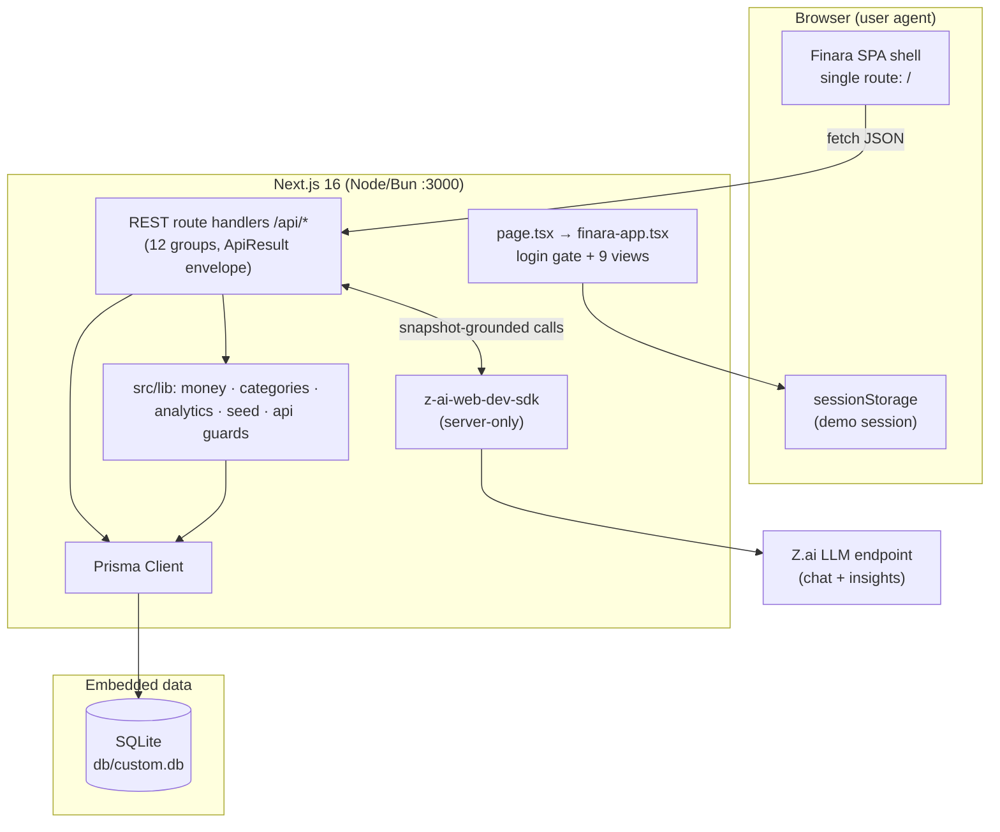
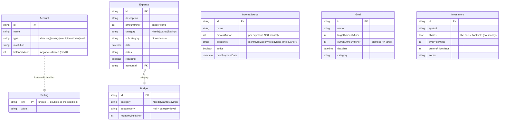

# Finara (Financial Dashboard) — Master Project Architecture Document (PAD) v1.0

**Classification:** Internal Engineering Reference
**Status:** DEFINITIVE, PRODUCTION-LOCKED BLUEPRINT
**Companion Documents:** `README.md` (user onboarding), `AGENTS.md` (agent instructions), `CLAUDE.md` (Claude Code conventions), `docs/Finara_Dashboard.png` (visual reference of the original app)
**Last Updated:** 2026-09-15
**Audience:** Senior Engineers, Tech Leads, DevOps, and Onboarding Engineers
**Rule:** Every architectural decision in this document traces to a specific rationale. Nothing is here "because it's popular."

---

## Table of Contents

1. [System Overview & Decisions](#1-system-overview--decisions)
2. [High-Level System Topology](#2-high-level-system-topology)
3. [Application Architecture](#3-application-architecture)
4. [Data Architecture](#4-data-architecture)
5. [Design System Reference](#5-design-system-reference)
6. [Security Architecture](#6-security-architecture)
7. [Testing Strategy](#7-testing-strategy)
8. [Build & Deployment](#8-build--deployment)
9. [Developer Handbook](#9-developer-handbook)
10. [Known Issues & Outstanding Tasks](#10-known-issues--outstanding-tasks)
11. [Key Files Reference](#11-key-files-reference)
12. [Glossary](#12-glossary)

---

## 1. System Overview & Decisions

### 1.1 Document Metadata & Purpose

Finara is a personal-finance dashboard: income, expenses, 50/30/20 budgets, accounts, investments, savings goals, CSV import, analytics, and AI-grounded insights. This PAD is the single source of truth for how the system is built and why. Use it when onboarding, extending a view/API pair, debugging the data flow, or replicating the architecture. It documents the current state only — no roadmap.

### 1.2 Technology Stack Summary

| Layer | Technology | Version | Key Rationale |
|-------|-----------|---------|---------------|
| Web framework | Next.js (App Router, Turbopack) | 16.1.3 | Route handlers + RSC-capable shell; the reference app it clones is a React SPA, and Next's single-page mode fits both the clone and the deployment sandbox |
| UI runtime | React | 19 | Required by Next 16; React Compiler enabled for automatic memoization discipline |
| Language | TypeScript (strict) | 5 | The app's core risk is money arithmetic and boundary data — strict typing is the cheapest defense |
| Styling | Tailwind CSS | 4 (CSS-first `@theme`) | Token-driven palette with zero runtime; v4's inline theme keeps shadcn tokens in one CSS file |
| Component primitives | shadcn/ui (new-york) on Radix | current | Accessible dialogs/selects/switches/tabs for free; matches the original app's look |
| Charts | Recharts | 2.15.4 | Declarative SVG charts matching the original dashboard's trend/area/pie visuals |
| ORM | Prisma | 6.19 | Typed SQLite access; schema-as-code with a one-command push loop for an embedded DB |
| Database | SQLite | 3 | Single-user personal finance app — an embedded file database removes all ops surface |
| AI | z-ai-web-dev-sdk | 0.0.18 | Server-side LLM access for the coach chat and insight phrasing; never shipped client-side |
| Validation | Custom guards (`src/lib/api.ts`) | — | Small, typed, dependency-free; mirrors the ActionResult envelope convention |
| Lint | ESLint 9 flat config + eslint-config-next | 9 | Includes React Compiler rules as hard errors (see §3.3) |
| Package manager / runtime | Bun | ≥ 1.3 | Fast installs; committed `bun.lock` guarantees reproducible resolution |

### 1.3 Architecture Decision Records (ADRs)

**ADR-001: Single-route SPA instead of file-based routing**

- **Context:** The original Finara app is a base44 SPA with client-side navigation. The clone must reproduce its UX (sidebar switching nine screens, dialogs, no full page loads) while running on Next.js.
- **Decision:** One page route (`src/app/page.tsx`) renders a client shell that switches `ViewId` state; all server interaction goes through `/api/*` route handlers.
- **Rationale:** Faithful clone semantics (instant view switches, preserved dialog state), plus the preview environment only exposes `/`. Nine page routes would add routing complexity the original doesn't have.
- **Consequences:** (+) Zero navigation latency; one layout to theme. (−) No per-view URL deep links; back button doesn't switch views. Acceptable for a dashboard clone; documented in AGENTS.md as an invariant.
- **Alternatives Rejected:** Next file-based routes per view (breaks SPA fidelity + sandbox constraint); react-router inside Next (duplicates what view state does with more machinery).

**ADR-002: Money as integer minor units everywhere**

- **Context:** Float arithmetic on currency produces classic rounding drift; the reference codebase (Scandi Haven) proved the integer-minor-units discipline in production.
- **Decision:** Every persisted money column is `Int` `*Minor` (cents). Conversion to/from decimal happens only at the UI/API edge via `toMinorUnits`/`formatMoney` in `src/lib/money.ts`.
- **Rationale:** Eliminates an entire class of financial bugs by construction; `Intl.NumberFormat` renders for humans.
- **Consequences:** (+) Exact sums, no drift, trivial DB aggregation. (−) Every new money field must remember the convention (enforced by review + AGENTS.md).
- **Alternatives Rejected:** Floats (rounding); decimal strings (parse complexity); DB DECIMAL (SQLite lacks native decimal).

**ADR-003: Prisma + SQLite over Postgres**

- **Context:** Single-user personal finance data with modest write volume; the repo must clone-and-run with zero external services.
- **Decision:** SQLite file at `db/custom.db` accessed through Prisma Client.
- **Rationale:** No server to provision, back up, or authenticate; `db:push` is the whole migration story for a demo-grade app; Prisma keeps the code typed and portable.
- **Consequences:** (+) One-command setup; file-level backup. (−) No concurrent multi-process writes (fine for this workload); upscaling to Postgres later requires schema provider swap + migrations (documented in §10).
- **Alternatives Rejected:** Postgres + Docker (ops overhead for a personal app); in-memory/localStorage (no server-side aggregation, no AI grounding).

**ADR-004: Demo login gate, not production auth**

- **Context:** The original app has real (Google + email) auth; this clone is a single-tenant demo whose credentials are published in the README.
- **Decision:** The login screen validates the documented demo credentials client-side; session presence is held in `sessionStorage` via a `useSyncExternalStore` external store.
- **Rationale:** Reproduces the original's sign-in UX without fabricating security. Real auth would add a password store, session backend, and multi-tenancy the clone doesn't need — and falsely implying it exists would be worse than honestly not having it.
- **Consequences:** (+) Faithful UX, zero auth complexity. (−) NOT production-safe; every doc states this explicitly; replacing it is the top backlog item (§10).
- **Alternatives Rejected:** NextAuth/Better-Auth with a demo user (half-fake security, more moving parts); no login screen at all (breaks clone fidelity).

**ADR-005: Database-level seed lock with completion marker**

- **Context:** Twelve route groups all call `ensureSeeded()` on first request; concurrent first requests (dashboard + insights fire together) double-seeded the database in practice — a module-global promise alone did not survive Next dev's per-bundle module instances.
- **Decision:** `seed()` inserts a unique `Setting._seed_lock` row first (DB-level mutex); losers poll for the `_seeded` marker (bounded ~5 s) before reading; the winner publishes `_seeded` last.
- **Rationale:** SQLite's unique constraint is atomic across every process/bundle that can touch the file — the only mutex that covers all observed failure modes. Verified with a 5-way concurrent request burst (zero duplication).
- **Consequences:** (+) Exactly-once seeding under any concurrency the app can generate. (−) Two sentinel rows live in `Setting` (filtered out of settings/export reads); a crashed seed leaves the lock held (fresh-DB retry is the remedy, documented).
- **Alternatives Rejected:** Module-global promise only (empirically insufficient in dev); `SELECT ... FOR UPDATE`-style advisory lock (not available on SQLite).

**ADR-006: AI grounding via server-side snapshot, with deterministic fallback**

- **Context:** LLM answers about personal finances must reflect the user's actual numbers; the model must also never be a single point of failure for the dashboard.
- **Decision:** Both AI endpoints first aggregate a compact snapshot from the DB (income, month-to-date categories, budgets, goals, portfolio). `/api/ai/chat` passes it as the system context; `/api/ai/insights` drafts deterministic insights, asks the model to polish them, and falls back to the drafts on any model error.
- **Rationale:** Prompt-injection-resistant grounding (the model sees numbers, not raw user text), and the dashboard never renders an empty error state when the model is down.
- **Consequences:** (+) Answers cite real figures; insights always render. (−) Snapshot assembly is server-only code that must stay in sync with new entities (AGENTS.md rule).
- **Alternatives Rejected:** Raw user question + full JSON dump to the model (injection risk, token cost); client-side SDK use (credential exposure).

**ADR-007: Income frequency normalization to monthly equivalents**

- **Context:** A biweekly $4,800 salary is $10,400/month, not $4,800 — naive sums misreport every derived KPI (savings rate, budget surplus, AI answers).
- **Decision:** `monthlyEquivalent(amountMinor, frequency)` in the pure `src/lib/money.ts`: biweekly ×26/12, weekly ×52/12, quarterly ÷3, one-time → 0. Every income total path (dashboard, analytics, insights, chat snapshot, income view) calls it.
- **Rationale:** One canonical, client-safe (no Prisma import) function keeps all five consumers consistent — it lives in `money.ts` precisely so client components can import it without dragging the DB client into the browser bundle.
- **Consequences:** (+) Correct KPIs everywhere. (−) "Monthly Income" excludes one-time windfalls by definition (an honest, documented choice).
- **Alternatives Rejected:** Raw sums (wrong); per-source next-payment projection (overkill for KPI cards).

---

## 2. High-Level System Topology



**Scaling characteristics and constraints:** single Node process; SQLite allows one concurrent writer (sufficient — writes are interactive user mutations, not bulk traffic). The AI path is the only external dependency; both AI features degrade deterministically when it is unavailable (ADR-006).

---

## 3. Application Architecture

### 3.1 The Layer Model

```
Layer 0: Browser shell      — finara-app.tsx: session gate, ViewId state, dialogs.
                                 Rule: no data fetching logic here; owns navigation + refresh signals.
Layer 1: Feature views      — *-view.tsx (9): each owns one useQuery slice + local UI state.
                                 Rule: render from DTOs; never duplicate persisted data into client state.
Layer 2: Shared UI          — ui-bits.tsx + shadcn primitives.
                                 Rule: no domain logic; props in, elements out.
Layer 3: API surface        — src/app/api/*: validation guards + envelope + aggregation calls.
                                 Rule: never throw across the boundary; internals logged server-side only.
Layer 4: Domain libraries   — src/lib (pure where possible): money, categories, types, analytics, seed.
                                 Rule: only analytics/seed/db import Prisma; client code imports the pure set only.
Layer 5: Persistence        — Prisma + SQLite schema (7 models, integer minor units).
                                 Rule: money columns are Int *Minor; no floats ever.
```

**The Golden Rule:** data flows strictly downward (view → API → domain → Prisma); types flow upward through the single `src/lib/types.ts` DTO contract. Nothing in Layers 0–2 may import Layer 4's DB-touching modules.

### 3.2 Annotated Directory Structure

```
financial-dashboard/
├── src/
│   ├── app/
│   │   ├── page.tsx                    ← SPA entry: renders FinaraApp
│   │   ├── layout.tsx                  ← Inter font (400–800), metadata, Toaster
│   │   ├── globals.css                 ← Tailwind v4 @theme tokens (Finara palette)
│   │   └── api/
│   │       ├── dashboard/route.ts      ← KPI/budget/recent-activity aggregation
│   │       ├── income/route.ts + [id]/ ← income sources CRUD
│   │       ├── expenses/route.ts + [id]/← expenses CRUD (category validation)
│   │       ├── accounts/route.ts + [id]/← connected accounts
│   │       ├── budgets/route.ts        ← GET list / PUT upsert the 3 category budgets
│   │       ├── goals/route.ts + [id]/  ← goals CRUD + contributions
│   │       ├── investments/route.ts + [id]/ ← holdings CRUD
│   │       ├── import/route.ts         ← batch CSV import (row-level validation)
│   │       ├── analytics/route.ts      ← trends, breakdowns, portfolio metrics
│   │       ├── settings/route.ts       ← key-value preferences GET/PUT
│   │       ├── export/route.ts         ← GDPR full JSON download (file response)
│   │       └── ai/{chat,insights}/route.ts ← snapshot-grounded LLM features
│   ├── components/
│   │   ├── finara/
│   │   │   ├── finara-app.tsx          ← shell: session store, view switching, dialogs
│   │   │   ├── sidebar.tsx             ← desktop nav + mobile top nav (ViewId export)
│   │   │   ├── login-view.tsx          ← demo credential gate (constants exported)
│   │   │   ├── dashboard-view.tsx      ← KPIs, gradient cards, budgets, activity, insights
│   │   │   ├── income-view.tsx / expenses-view.tsx / accounts-view.tsx
│   │   │   ├── investments-view.tsx / import-view.tsx / analytics-view.tsx
│   │   │   ├── goals-view.tsx / settings-view.tsx
│   │   │   ├── add-transaction-dialog.tsx ← quick-select grid + manual form + quick amounts
│   │   │   ├── ai-coach-dialog.tsx     ← chat with quick actions + suggested questions
│   │   │   └── ui-bits.tsx             ← StatCard, GradientCard, EmptyState, TrendPill, …
│   │   └── ui/                         ← shadcn primitives (button, dialog, select, …)
│   ├── hooks/
│   │   ├── use-api.ts                  ← useQuery (loading/error/refresh) + mutate envelope
│   │   └── use-toast.ts                ← shadcn toast hook
│   └── lib/
│       ├── money.ts                    ← minor-units conversion, formatting, monthlyEquivalent (pure)
│       ├── categories.ts               ← 50/30/20 taxonomy, emoji map, enums (pure)
│       ├── types.ts                    ← DTOs crossing the boundary (pure)
│       ├── api.ts                      ← ApiResult envelope + validation guards (server)
│       ├── analytics.ts                ← getDashboard/getAnalytics aggregations (server)
│       ├── seed.ts                     ← idempotent, lock-guarded demo data (server)
│       └── db.ts                       ← Prisma client singleton (server)
├── prisma/schema.prisma                ← 7 models, Int *Minor money columns
├── db/                                 ← SQLite runtime storage (gitignored, .gitkeep)
├── docs/                               ← SSH wrapper + push runbook + reference image + prompts
├── .env.example                        ← DATABASE_URL only
├── AGENTS.md / CLAUDE.md / README.md   ← agent + human documentation
└── (eslint.config.mjs, tsconfig.json, tailwind.config.ts [legacy], postcss.config.mjs, components.json)
```

### 3.3 Critical Code Patterns

**Pattern 1 — The API envelope with validation guards** (`src/lib/api.ts`):

```typescript
export type ApiResult<T> = { ok: true; data: T } | { ok: false; error: string };

export function ok<T>(data: T, init?: number): NextResponse<ApiResult<T>> {
  return NextResponse.json({ ok: true, data }, { status: init ?? 200 });
}

export class ValidationError extends Error {}

export function errorResponse(error: unknown): NextResponse<ApiResult<never>> {
  if (error instanceof ValidationError) {
    return fail(error.message, 400);            // guard failures are customer-safe by construction
  }
  console.error("[api] unhandled error:", error); // internals stay in server logs
  return fail("Something went wrong. Please try again.", 500);
}
```

*Why this pattern:* one boundary shape for every route means the client `mutate()`/`useQuery()` helpers never parse error prose, and operator detail can never leak to the browser. Guards (`requireNonNegativeInt`, `requireString`, `requireIsoDate`) make invalid input a typed 400 instead of a runtime crash.

**Pattern 2 — Concurrency-safe idempotent seed** (`src/lib/seed.ts`):

```typescript
try {
  // Unique key = DB-level mutex across processes AND route bundles.
  await db.setting.create({ data: { key: "_seed_lock", value: "acquired" } });
} catch {
  await waitForSeedCompletion(); // poll for the _seeded marker (bounded ~5s)
  return;
}
// … createMany for each entity …
// Publish completion LAST so waiters never read a partial database.
await db.setting.create({ data: { key: "_seeded", value: new Date().toISOString() } });
```

*Why this pattern:* the first browser load fires `/api/dashboard` and `/api/ai/insights` simultaneously; a module-global promise did not survive Next dev's per-bundle module instances and double-seeded the DB (observed, then fixed). SQLite's unique constraint is the only mutex covering every failure mode. Verified with a 5-request concurrent burst — zero duplication.

**Pattern 3 — M-3 external store for the demo session** (`finara-app.tsx`):

```typescript
// Server snapshot renders the logged-out shape; the client snapshot
// (sessionStorage cache) takes over after hydration. Never a useState
// initializer (freezes the SSR shape) and never effect-body setState
// (React Compiler lint error).
const session = useSyncExternalStore(subscribeSession, readSessionCache, getServerSession);
```

*Why this pattern:* the login gate must not hydration-mismatch, and `react-hooks/set-state-in-effect` is a hard error under the React Compiler — this is the sanctioned idiom (inherited from the Scandi Haven reference codebase).

**Pattern 4 — Stable memo dependencies** (`expenses-view.tsx`):

```typescript
// Deps must be stable state references — `query.data`, never the
// derived `const expenses = query.data ?? []` (fresh array identity
// per render breaks compiler-preserved memoization).
const visible = useMemo(() => {
  const filtered = (query.data ?? []).filter(/* … */);
  /* … sort, slice … */
}, [query.data, search, tab, sortDesc, expanded]);
```

**Pattern 5 — AI grounding snapshot** (`api/ai/chat/route.ts`):

```typescript
const context = await snapshot(); // income (normalized), month-to-date by
// subcategory, budget usage, goals, portfolio, accounts — numbers only.
const systemPrompt = [
  "You are Finara's AI financial coach…",
  "Never invent figures that are not derivable from the snapshot below.",
  "CURRENT FINANCIAL SNAPSHOT:", context,
].join("\n");
```

*Why this pattern:* the model receives aggregated facts rather than raw user text, so answers cite real numbers and prompt-injection surface is minimized; the insights twin adds a deterministic fallback so the dashboard degrades gracefully when the model is down.

---

## 4. Data Architecture

### 4.1 Database Schema



Notes: `Investment.shares` is a `Float` because share counts are not money (fractional shares are legitimate); prices and all other amounts are integers. `Setting.key` uniqueness is load-bearing — it implements the seed mutex (ADR-005).

### 4.2 Data Models

DTOs in `src/lib/types.ts` are the wire contract: dates serialize as ISO strings, money as `*Minor` integers. The client never sees Prisma types — routes map rows to DTOs explicitly (e.g. `toDto` in each route file).

### 4.3 Persistence Strategy

- **Client:** Prisma singleton via `globalThis` cache (`src/lib/db.ts`) — one connection pool per process, logging `error`/`warn` only.
- **Migrations:** `bun run db:push` (declarative sync). The project carries no migration history yet; adopting `prisma migrate dev` is listed in §10 for when the schema starts evolving in production.
- **Seeding:** automatic on first API request (ADR-005). Reset procedure: stop the server, delete `db/custom.db`, `bun run db:push`, restart (deleting the file under a live server splits the connection pool across inodes — an observed failure mode, documented in AGENTS.md).
- **Backup:** the database is one file (`db/custom.db`) plus the JSON export from `/api/export`.

---

## 5. Design System Reference

### 5.1 Typographic System

Inter (400/500/600/700/800) via `next/font/google`, exposed as `--font-inter`. Hierarchy: page titles `text-2xl/3xl bold`, KPI values `text-2xl bold tabular-nums`, labels `text-sm medium slate-500`, captions `text-xs slate-400`. All money uses tabular numerals.

### 5.2 Color Tokens

Defined once in `src/app/globals.css` (`@theme inline` + `:root` oklch literals — Tailwind v4 drops `var()` chains inside `@theme`, so shadcn semantic tokens are literal values, kept in sync with the palette block):

| Token | Approx. hex | Usage | Contrast |
|-------|-------------|-------|----------|
| primary | #10B981 (emerald-500) | Primary buttons, active-nav accent, sync pill | 2.5:1 on white (large/UI elements only) |
| background | #F1F5F9 (slate-100) | App canvas | — |
| card | #FFFFFF | Card surfaces | 21:1 body text (slate-900) |
| foreground | #0F172A (slate-900) | Primary text | 16:1 on white |
| sidebar | #1E293B (slate-800) | Navigation chrome | white text 12.6:1 |
| Income / Expenses / Net / Savings accents | emerald-600 / red-500 / amber-500 / violet-500 | KPI icon tiles, trends | — |
| Gradient cards | orange→orange-600 · cyan→teal-600 · blue→indigo-600 · purple→fuchsia-600 | Dashboard feature cards | white text ≥ 4.5:1 on gradients |

### 5.3 Component Primitives

shadcn/ui (new-york style, Radix-based) for dialogs, selects, switches, tabs, tables, toasts. Finara composites in `ui-bits.tsx`: `StatCard`, `GradientCard`, `EmptyState`, `SectionCard`, `TrendPill`, `LoadingRows`, `ErrorNote`, `SurplusBadge`. Long lists get `max-h-* overflow-y-auto` with the `finara-scroll` custom scrollbar.

### 5.4 Motion

Subtle transitions only: card hover `-translate-y-0.5`, dialog scale/fade from `tw-animate-css`, chart mount animations from Recharts defaults. No global reduced-motion override yet (backlog, §10).

---

## 6. Security Architecture

### 6.1 Security Rules

| Rule | Enforcement |
|------|-------------|
| All API input is untrusted and validated (type, range, enum, length) | `require*` guards in `src/lib/api.ts`; guards throw `ValidationError` → 400 |
| Money never arrives as floats from clients | `amountMinor` must be an integer; UI converts via `toMinorUnits` first |
| Category enums are server-authoritative | `CATEGORIES`/`ACCOUNT_TYPES`/`FREQUENCIES` sets checked in every route |
| No secrets in the repo | `.gitignore` rejects `.env*` (except example), `*.key`, `ssh-key.txt`; deploy key supplied externally per push |
| AI SDK stays server-side | Imported only inside `/api/ai/*` route handlers (client bundle audit by convention; AGENTS.md rule) |
| Operator detail never reaches the client | `errorResponse` logs internally, returns generic 500 copy |
| Import bounded | ≤ 2000 rows/batch, file ≤ 10MB client-side, CSV-only |

### 6.2 Security Utilities

`src/lib/api.ts` (guards + envelope), `.gitignore` key rejection, `docs/ssh_git_wrapper_v3.py` (0600 temp key, shred-after-push, `IdentitiesOnly`).

### 6.3 Authentication & Authorization

**There is no production authentication.** The login view checks the documented demo credentials (`sepnetflix2023@outlook.com` / `Abcd1234`) client-side; the "session" is a `sessionStorage` flag consumed through `useSyncExternalStore`. The Google button honestly reports it is unavailable. Every layer of documentation states this. Replacing the gate with a real provider (and adding per-user data scoping) is the first backlog item in §10.

### 6.4 Threat Model (top vectors and current posture)

| Vector | Posture |
|--------|---------|
| Prompt injection through AI chat | Mitigated: model sees an aggregated numeric snapshot, not raw DB text or user content mixed with data |
| XSS via transaction descriptions | React escapes by default; no `dangerouslySetInnerHTML` anywhere |
| CSV import abuse | Bounded size/rows; quoted-field parser; invalid rows skipped with per-row reporting |
| Secret leakage | Keys/env rejected by gitignore; wrapper shreds temp keys; export contains user data only |
| Unauthenticated API abuse (once deployed) | **Open** — demo gate is client-side; must be fixed before any real deployment (§10) |

---

## 7. Testing Strategy

### 7.1 Test Distribution

| Category | Count | Framework | Location |
|----------|-------|-----------|----------|
| Lint gate | 1 suite | ESLint 9 + React Compiler rules | repo root |
| Type gate | 1 suite | `tsc --noEmit` (strict) | repo root |
| Automated unit/E2E | 0 | (Vitest + Playwright planned) | — |
| Browser verification | ~20 golden-path checks | Manual agent-browser session | n/a |

### 7.2 Verified at build time (evidence-backed)

Login → dashboard; all nine views render live data; add-expense (quick-select → quick amounts → submit → list refresh); CSV import 3-step flow (3 rows, smart categories, DB verified); goal contribution; AI coach chat returns grounded figures; AI insights render with fallback; GDPR export downloads valid JSON; mobile hamburger nav; zero console errors on fresh load; 5-way concurrent seed burst with zero duplication.

### 7.3 Coverage Thresholds

None configured yet — the lint + typecheck gates are the current bar. Introducing Vitest with thresholds on `src/lib` (pure modules: `money`, `categories`, seed lock logic) is the planned first step (§10).

### 7.4 Pre-Push Checklist

- [ ] `bun run lint` exits 0
- [ ] `bun run typecheck` exits 0
- [ ] Touched flow exercised in a browser (golden path)
- [ ] No secrets staged (`git ls-files | grep -E "\.env$|\.key$|ssh-key"` is empty)
- [ ] Commit messages follow Conventional Commits
- [ ] Push via `docs/ssh_git_wrapper_v3.py` to `main`

---

## 8. Build & Deployment

### 8.1 Production Build

```bash
bun run build   # next build (Turbopack)
bun run start   # next start -p 3000
```

Output: standard Next build (`.next/`). No `output: "standalone"` in the committed config — the deployment story is a plain Node host.

### 8.2 Environment Variables

| Variable | Required | Description | Default |
|----------|----------|-------------|---------|
| `DATABASE_URL` | Yes | SQLite URL relative to `prisma/schema.prisma` | `file:../db/custom.db` (from `.env.example`) |

No other variables exist. AI access is configured by the hosting environment's SDK credentials (the `z-ai-web-dev-sdk` reads its own runtime configuration — nothing is committed).

### 8.3 Docker Configuration

None. The app is a Node process + one SQLite file; containerization is deliberately out of scope until a real deployment target exists.

### 8.4 CI/CD Pipeline

No CI configured. The push contract (gates green → wrapper push to `main`) is documented in `AGENTS.md` and `docs/how-to-git-push-using-ssh-wrapper_SKILL.md`; adding a GitHub Actions gate that replays `lint + typecheck + build` is backlog (§10).

---

## 9. Developer Handbook

### 9.1 Local Setup

```bash
cp .env.example .env
bun install
bun run db:push     # creates db/custom.db
bun run dev         # http://localhost:3000 — demo credentials on the login card
```

First API request auto-seeds ~6 months of demo history (96 expenses, 4 income sources, 4 accounts, 3 budgets, 3 goals, 8 holdings, settings).

### 9.2 Common Commands

| Command | Purpose |
|---------|---------|
| `bun run dev` / `build` / `start` | Dev / production build / serve |
| `bun run lint` / `typecheck` | Quality gates (must be green) |
| `bun run db:push` / `db:generate` | Apply schema / regenerate Prisma client |
| `python3 docs/ssh_git_wrapper_v3.py --key-file <path> --remote git@github.com:nordeim/financial-dashboard.git` | Authenticated push to `main` |

### 9.3 Code Style Rules

Enforced by ESLint 9 (flat) + TypeScript strict + React Compiler rules: no `setState` in effect bodies, stable memo deps, `unknown` over `any`. Conventions beyond tooling (minor units, envelope, pure/server module split) are in `AGENTS.md` and reviewed manually.

### 9.4 Git Workflow

Branch `main` only (this repo's contract). Conventional Commits, atomic scope (`feat(expenses): …`). Never commit `.env*`, keys, or `db/*.db`. Pushes go through the SSH wrapper with an externally-supplied deploy key.

---

## 10. Known Issues & Outstanding Tasks

| Priority | Issue | Impact | Status |
|----------|-------|--------|--------|
| CRITICAL | Demo login gate is client-side only; API is unauthenticated once deployed | Anyone reaching a deployed instance can read/write all data | Open — replace with real auth before any real deployment |
| HIGH | No automated test suite (Vitest/Playwright) | Regressions in money math or guards rely on manual verification | Open — planned |
| HIGH | No CI pipeline | Push gate is honor-system | Open — planned |
| MEDIUM | No migration history (schema via `db:push`) | Schema evolution on live data is unsafe | Open — adopt `prisma migrate dev` |
| MEDIUM | Analytics income trend is flat (monthly normalization applied to all months) | Trend chart understates historical income variation | Open — by design until per-month income events exist |
| LOW | `tailwind.config.ts` is unused legacy scaffold | Confusing dead file | Open — safe to delete with a docs pass |
| LOW | No `prefers-reduced-motion` override | Accessibility polish | Open |
| LOW | One-time income sources excluded from monthly totals | KPI definition choice, documented | By design |

---

## 11. Key Files Reference

| File | Lines | Purpose |
|------|-------|---------|
| `src/components/finara/import-view.tsx` | ~397 | 3-step CSV import with client-side parsing + category guessing |
| `src/components/finara/add-transaction-dialog.tsx` | ~378 | Expense/income dialog: quick-select grid, quick amounts, validation |
| `src/components/finara/investments-view.tsx` | ~359 | Holdings table, KPIs, sector donut, add-holding dialog |
| `src/components/finara/analytics-view.tsx` | ~340 | Four analytics tabs with Recharts + CSV export |
| `src/components/finara/dashboard-view.tsx` | ~331 | KPI cards, gradient cards, budget overview, AI insights |
| `src/components/finara/goals-view.tsx` | ~308 | Goal cards, progress bars, contributions, create dialog |
| `src/lib/analytics.ts` | ~276 | Server aggregations: `getDashboard` / `getAnalytics` |
| `src/components/finara/ui-bits.tsx` | ~241 | Shared composites (StatCard, GradientCard, EmptyState, …) |
| `src/components/finara/expenses-view.tsx` | ~233 | Expense summary, search/tabs, history list |
| `src/components/finara/settings-view.tsx` | ~224 | Preferences, notifications, GDPR export/import panels |
| `src/lib/seed.ts` | ~197 | Idempotent, lock-guarded demo seed (ADR-005) |
| `src/components/finara/finara-app.tsx` | ~192 | SPA shell: session store, view switching, dialog wiring |
| `src/components/finara/login-view.tsx` | ~196 | Demo credential gate mirroring the original sign-in |
| `src/components/finara/ai-coach-dialog.tsx` | ~182 | Chat UI with quick actions + suggested questions |
| `src/lib/types.ts` | ~141 | DTO contract for the whole client/server boundary |
| `src/app/api/import/route.ts` | ~103 | Batch import with row-level validation and date parsing |
| `src/lib/categories.ts` | ~101 | 50/30/20 taxonomy single source of truth |
| `prisma/schema.prisma` | ~92 | 7 models, integer minor-unit money |
| `src/lib/api.ts` | ~72 | ApiResult envelope + validation guards |
| `src/lib/money.ts` | ~74 | Minor-units conversion, formatting, `monthlyEquivalent` |

---

## 12. Glossary

| Term | Meaning |
|------|---------|
| **Minor units** | The smallest currency division (cents for USD); all money is stored as integers in minor units |
| **50/30/20 rule** | Budget taxonomy: 50% Needs, 30% Wants, 20% Savings — the app's expense category set |
| **Monthly equivalent** | An income amount normalized to its monthly value (biweekly ×26/12, weekly ×52/12, quarterly ÷3) |
| **DTO** | Data Transfer Object — the typed wire shapes in `src/lib/types.ts` (ISO dates + minor-unit money) |
| **Seed lock** | The unique `Setting._seed_lock` row that guarantees exactly one seeder (ADR-005) |
| **ViewId** | The SPA navigation state union (`dashboard | income | expenses | …`) exported from `sidebar.tsx` |
| **M-3 idiom** | `useSyncExternalStore` pattern for browser-storage-backed state that must not hydration-mismatch |
| **ApiResult envelope** | `{ ok: true, data } | { ok: false, error }` — the uniform API response shape |
| **SSH wrapper** | `docs/ssh_git_wrapper_v3.py` — authenticated push helper with temp-key materialization and shredding |
